= Starflight - The Lost Colony
:toc: left

== Gameplay Manual

(thanks Vince Converse)

== OPENING STORY

Many centuries ago, our forefathers departed the ancient cradle world of Earth on a mission to colonize another star system. But they never reached their destination because the ship was apparently destroyed in deep space en route. It's loss was a mystery that would haunt the other Noah colonists for centuries to come, until finally forgotten.

But Noah 3 was not destroyed; it was caught in a massive wormhole and deposited into unknown space ten thousand light years from Earth. Badly damaged and losing life support, the colonists of Noah 3 desperately searched nearby star systems for a new home, but time was short. After many days and dozens of hyperspace jumps, their damaged life support systems were running out. They had time to explore one more star, so their scientists and astronomers peered through their devices at the nearest stars and found the most likely system--a class G star, slightly larger and more luminous than Earth's sun, with a full complement of planets.

Captain Meriwether orders one final hyperspace jump that takes them to the outskirts of the system. The ship heads inward toward the gravity well of the sun. They pass the orbital path of four huge gas giants, and an extensive asteroid ring. After many hours they reach the inner system--where rocky planets might be habitable. As they clear the innermost gas giant they find four rocky worlds beyond the asteroid ring, and their spirits soar! With so many inner planets, their odds just went way up.

At roughly 160 million miles from the sun, the fourth planet in the system is a frozen wasteland with no atmosphere. Captain Meriwether suspected as much. Although it would have been nice to have been rewarded with a habitable world on the first try, the planet's distance from the sun was just too great--beyond the "warm zone" of the inner system. This planet was nearly twice as far out as Earth was from her sun.

As they head further in, they reach the third planet at 80 million miles from the sun, but it is a  barren rocky world with no atmosphere and covered with craters. Fear begins to take hold on the ship, in the large passenger compartments as well as among the bridge crew. Two out of four just halved their odds of survival.

The tension is palpable as they approach the second planet out from the sun at 55 million miles out. This world looks promising from a distance--it's about the right size, and has a cloudy atmosphere, although it's contents cannot be determined yet. The ship heads in, and everyone is on edge with anticipation and fear mingled with some hope. As soon as they are close enough, the science teams begin scanning and analyzing the world. Fear strikes the faces of everyone on the ship. Many are unable to cope with it and turn inward, or flee the report monitors. Their worries are justifed: this world has a thick, toxic atmosphere.

Panic breaks out among the three thousand colonists aboard Noah 3, for only one world remains and it is too close to the sun for any reasonable habitation. Nevertheless, the captain orders the ship further down the gravity well of the sun toward the first planet. As feared, it's a fireball, for the tidal forces of gravity, being only 25 million miles out, have broken the crust and continually crushed then released the small world, over and over for eons. The captain ignores pleas coming from the passenger compartments: "What are we going to do?". "Now what?". "God, save us!".

Captain Meriwether orders the massive ship into a slow, wide elliptical orbit around the sun.As Noah 3 comes around the sun, the unbelievable happens. Sensors pick up another planet! One that they had missed earlier due to it's position behind the sun. He jumps from his seat and grabs the con, "Science Officer Jenner to the bridge!" When Jenner returns to the bridge, complaining about the end of all their lives, the captain yanks him to the sensor display. "Whaddya make of that, eh?"

The science officer squints his eyes as he looks up at the sensor display. "What in the--".

Captain Meriwether punches the intercom, "Attention everyone, this is the captain. We have located another planet. I repeat, there is one more planet! We missed it the first time because it's behind the sun." Sobs of grief and panic abate for a moment. Many do not believe it. Many missed the announcement and ask what the captain said. The brave colonists, occupying gigantic living spaces that doubled as landing craft, filled the ship's entire two mile length--and fully half of that was devoted to engines and botanical gardens.

Jenner's fingers flashed over his controls and keys in a rush of activity, adjusting the sensors and pulling in more data as Noah 3 cleared the corona of the star and the planet came into range. He glances up at the captain. "Class . . . M."

Everyone on the bridge gasps in unison, as the captain leaps from his chair.

Jenner studies the readings coming in from long-range sensors, and his eyes grow wide. "Liquid . . . water." The bridge crew look around at each other, bewilderment in their eyes.

"Point eight . . . gee." The captain's mouth begins to open in awe, his breathing quickens.

"Concentrations of . . . oxygen . . . and . . . nitrogen."

The bridge crew cried together in unison. Science Officer Jenner slid down form his seat to the floor, sobbing. Captain Meriwether slumped into his seat, mouth gaping wide open, eyes staring at the bulkhead in stunned silence. After a moment, he punched the intercom button and began to speak. His voice caught in his throat, so he swallowed audibly.

"Attention, all passengers. This is the captain."

The passenger compartments suddenly grew silent, as everyone stared up at the report monitors to listen.

"Off-- Officer Jenner. Please repeat your analysis for the benefit of the whole ship."

Jenner grasped his chair, hauling himself up, wiped his eyes and cleared his throat. He punched his own intercom button and read the analysis again, carefully.

"Liquid water. Point eight gee." Murmuring began to come through the tinny speakers on the bridge from the passengers. He looked to the captain, who nodded to him in approval.

Then Jenner said in a whisper, "Concentrations of oxygen and nitrogen."

The intercom buzzed with a thunderous applause and cries of relief, giving the bridge crew a full set of smiles. Back on the passenger levels, many had fallen to their knees or prostrate on the ground, apparently praying. Many more could be heard praising the captain, his crew, and the technology of their ship. Those with any military background, true to form, saluted each other, grasped arms. Throughout the complement, everyone hugged one another. Tension turning to joy resulted in outbursts of sobbing and cries of joy. They were lost, doomed to a crowded, unimaginable mass death, and suddenly they had hope and joy.

Noah 3 approached the world, which turned out to be the fourth in the system, closest to the asteroid belt (which might explain how their sensors had missed it, in addition to it being on the opposite side of the sun from their approach).

Captain Meriwether ordered the navigator to go into low orbit. Suddenly, an alarm klaxon blared throughout the ship.

Chief Engineer Donovan screamed over the din, "Captain! Coolant is gone! The reactor's overheating. It's gonna go!"

Captain Meriwether jumped from his seat and jammed his thumb into the intercom once again, "Attention, this is the captain. Sorry to spoil the celebration, but we have a new problem. The reactor is about to go critical! All passengers, to your descent chambers, immediately and launch when ready!" He looked at the eager faces on the bridge and said, "Abandon ship! To the escape pods! I repeat, all hands, abandon ship!"

As viewed from below Noah 3, eight football-field sized landing craft, shaped like large cigars with wings, detached from the ship's hull. They descended, streaking toward the planet as the superstructure of Noah 3 cracked and became a tumbling fireball across the sky.

Hours later, the survivors emerged from their cocoons on a new world. The captain and his crew had followed the passenger craft in their escape pods and touched down near the largest cluster of Landers. But in the urgency of the situation, not all had made it down safely. One Lander lost it's attitude thrusters and missed the atmospheric entry trajectory, tumbling and falling into the depths of a large, unnamed ocean.

Another Lander had been damaged during the breakup of the mother ship. Three hundred and fifty people had survived accidental passage through a wormhole across the galaxy only to be lost in the end, during descent. It was a tragedy the defied reason, and their lives were honored in a memorial tower erected at the center of the first and largest settlement.

Captain Meriwether knew they had been lucky to have survived at all. Six out of eight wasn't bad considering their dire situation: the loss of life support, the loss of their reactor--the very reactor that was to give their colony power for generations to come.

Although safe, they would have wuch work to do on this new world. And what a world it is, absolutely overrun with plant life! If sensors are correct, the oceans are as full of life as the continents, and some have already reported seeing animals--herds of tens of thousands of herbivores and smaller numbers of predators.

Who knew what else remained to be discovered on this huge world, untouched by human hand for eons?

They were starting over on a completely fresh and untouched world. After much debate and proposal,  a vote gave their new world it's name--Myrrdan.

There was only one question to ponder: would they depart to savagery within a few generations, or would their children build a peaceful civilization and skip the millenia of barbarism that had plagued Earth's long history? Would their children embrace religion, or science and technology, or military conquest, or free trade and capitalism?

Captain Meriwether was not sure that he cared, as long as their civilization flourished, and set out that very day to build it.

== INTRODUCTION

**Starflight: The Lost Colony** is space simulator game following in the grand tradition of the original Starflight game series. The game itself incorporates role-playing elements as well as arcade space combat in a vast open galaxy filled with countless star system and randomly generated planets. Players are able to hire crewmembers and customize their ship, take on missions, communicate or fight with multiple alien races, explore countless star systems and planets, and land to collect artifacts, mine minerals, or capture lifeforms from planetary surfaces.

**The Lost Colony** will use many of the same methods employed in the original games.  This document details the plot and features of the new game as well as providing information on all of the alien races, key plot elements, key items, space travel, landing on planets, navigation with the starmap, and so on.  The design outline follows exactly the features that will be presented in the actual game, using as many diagrams and mockups included in the game as possible.

The new game will be updated significantly over the originals, but the design goal is that it will have the same look & feel.

=== Recognition and Credit

This game was made possible by the generosity of the copyright owner, Rod McConnell, founder of Binary Systems, which retains the copyright when Electronic Arts originally published the games in 1986 and 1989.  While no sequel was ever developed, Starflight has been ported to many systems, the last of which was Sega Genesis in 1991. It was ported to Commodore 64, Atari ST and Amiga.  Rod McConnell still owns the copyright.  A condition of granting **The Lost Colony** project permission to make this game is that it continues the franchise without gain. It must be released as freeware, though not necessarily as public domain. We may do whatever we want with the game under that restriction, but may not sell it for profit. We may also not transfer ownership of the game to anyone. Any and all publishing issues will be strictly ignored.

All those who have agreed to be apart of this new team and work on this design and on the game, are to think retro.  This will enable **The Lost Colony** to bring back the magic that the games originally held in the minds of the fans, who even to this day share fond memories of the Starflight game series. While the two original games were far ahead of their time, we don’t want to use the latest technology.  This new game will be enjoyable because of its content, not because it uses “shaders”.  **The Lost Colony** is mostly 2D, with a few portions done in 3D (such as planet rotations).

=== Origins of the Project

Jonathan Harbour, the head of **The Lost Colony** project, petitioned Mr. Rod McConnell to continue the Starflight game in a different direction.  Mr. Rod McConnell has graciously granted this project permission to continue the original plan for the sequel game in Allegro and using a 2D engine, as a separate branch from the Starflight III project. The time period for **The Lost Colony** game takes place shortly after the events in SF1, but before SF2. This time period will allow the game to introduce a few of the alien races that were a mainstay in SF1, and give the player an opportunity to experience a series of events in the same Starflighy universe except in a completely setting. **The Lost Colony** will not interfere with SF2 or lead up to it, because the game play takes place elsewhere in the galaxy, far from the settings of the first two games.  The Lost Colonywill take advantage of modern graphics, sound, and a cross-platform game library.

=== Start of the Game

At the start of the game, the player will have a very simple ship that has no upgrades, and fuel will be very expensive as a result of an inefficient engine. The player will barely be able to travel to the next star system because fuel will be so costly. The player will first be presented with a number of training missions to get them familiar with the basic features of the game. These missions will be followed by a number of increasingly challenging missions designed specifically for their character class. A final set of quests will challenge the player to uncover and resolve a series of difficult challenges by accumulating clues gathered from communicating with spacefaring alien races.

== PROFESSIONS

Before the captain creation process, the player must choose a profession and then select the initial attributes and skills of the captain.  These attributes are described in further detail in Ship System and Crew. On Myrrdan, an international cooperative project was launched to build an orbiting space station called Starport.  This station houses a shipyard for construction and repairing starships of all types, including a Scientific Scout ship, a Freelance Cargo Hauler, and a Miltary Warship.

The starbase / starport are where you make upgrades to your ship. This is another hugely fun role-playing element, and the ship itself is sort of a character in the game. Either from cash investments or through missions will ship upgrades become available. (i.e. The player could be given the engineering plans for new technology in exchange for some service, which may or may not be capable of improving the ship.)

There are three professions that determine the skills of your captain as well as the capabilities of your ship: **Scientific**, **Freelance**, and **Military**.  Depending on your career choice, there are modifiers and capabilities that differ with each profession.  For the ship capabilities, there are maximum capabilities that are dramatically different for each profession.  The crew modifiers also factor in depending on profession, either reducing or increasing total capabilities of a crew member’s skill in that position.  For instance, if a Science Officer has a Science skill of 100, then that skill will be effectively increased to 200 since the scientific crew modifier for Science is 200%. Likewise, there are reductions in some skill areas. This helps to depict the differences in the professions and will have a dramatic effect on game play (as well as encouraging the player to play again using a different profession!

The skill percentage modifiers for a profession should balance out to 500 points (Science, Navigation, etc). The ship capabilities are shown as maximum values. By default, all ships begin with all systems set at **None** or at a **Low** level, and through experience and use will slowly increase to the maximum.

=== Scientific

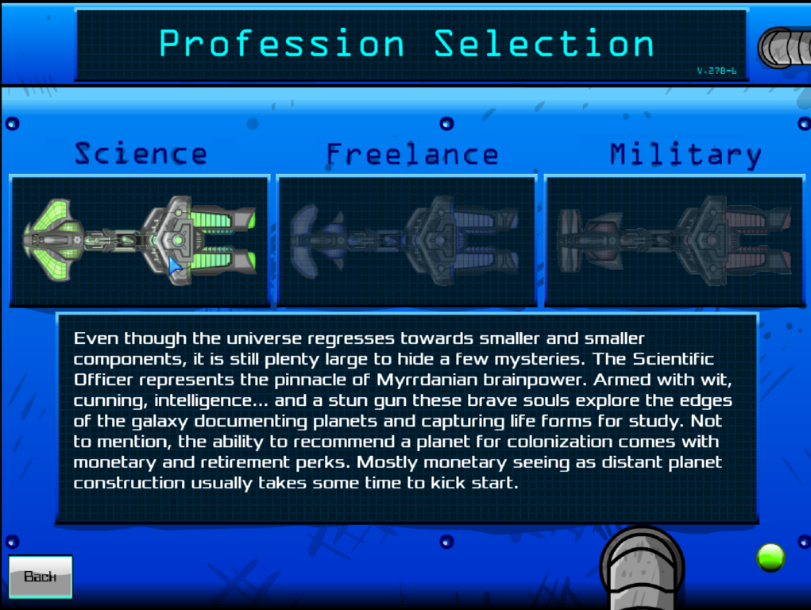

The Scientific player is more in tune with the majority of Myrrdanian society, as the very name of the world reflects the goals established in the planetary charter set up by Captain Meriwether and the original leaders of the Noah 3 expedition, upon surviving the landfall on their new world--to establish a society dedicated to scientific advancement and technological progress. They believed these core values would prevent their future generations from degenerating into barbarism. The constitution established, first of all, that a single federal government would oversee the general welfare of the entire world, from a socio-political point of view, which includes the military. Tasked with social welfare are individual states. Scientific organizations are funded by grants as well as endowments by the states in which they do research and development. Someone has suggested that this civilization is a sort of Technocracy.

The player who chooses a scientific career (and corresponding science ship) must accept that much time will be devoted to scientific missions, especially early on in the game. Science ships are not powerful warships capable of fighting armadas of aliens. A science ship is mainly devoted to exploration and has only defensive shields and minor weapons. The benefits of a science vessel, however, are very appealing. A science ship maximizes the capabilities of the Science, Navigation, and Medical officers. Therefore, any crew member may occupy those positions regardless of individual skill. This reflects the prototype technology in a science ship that is not available to the corporate or military professions. The scientific player may only choose scientific missions, and may recommend planets for colonization. The high-output engine and shield max for the scientific player reflects the use of prototype technology not attainable by the other players.

Science ships have some very strong points, as well as some very weak points, and might be thought of as a prototype of technologies. Ship capabilities, though, are not balanced and may be adjusted to any. The ship capability points will be adjusted during game play testing to optimal values for each profession. But keep in mind the differences in the professions—there’s a lot more involved than just ship stats. For instance, the military player cannot recommend planets, and science ships cannot engage in combat missions, so choice of profession should dictate how the game is played. The Scientific player may only take on scientific missions. The overall theme for a scientific player is: **“Explore new worlds, seek out new life forms, and boldly go…”**

.Scientific ship capabilities (total 20)
[cols="3,2,2",options="header"]
|========================================================================
| System           | Start Level   | Maximum
| Engine           | 0             | 6
| Shielding        | 0             | 6
| Armor            | 0             | 4
| Laser Cannon     | 0             | 2
| Missile Launcher | 0             | 2
| Cargo Pods       | 0             | 16
|========================================================================

.Scientific crew modifiers (total 500 points)
[cols="1,1"]
|========================================================================
| Science       | 200%
| Navigation    | 75%
| Tactical      | 50%
| Engineering   | 75%
| Medical       | 100%
|========================================================================

=== Freelance

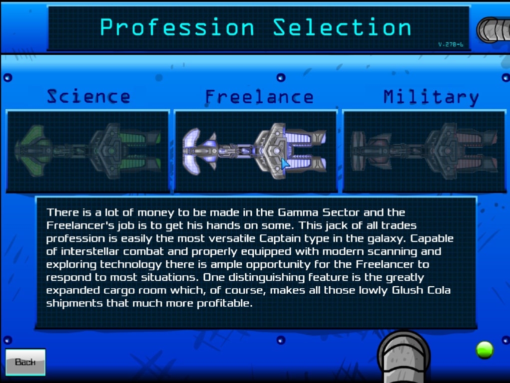

The Freelance player is more concerned with making money and earning profits than with exploration or military action. A freelance player is sponsored by a conglomerate of corporations and is considered a freelance contractor working for one of these mega-corporate entities. The task of a freelance player is to locate the richest trade routes in the sector and mineral deposits. Freelance players are not concerned with planet colonization because that would take away profits from mining operations! Because freelance ships are often cargo-laden, they have slower engines and less shielding and armor. The freelance player may accept corporate and scientific missions.

Realistically, no one with the ability to fly around the galaxy will actually work for a corporation and use the company’s ship. More realistic is that the player is an owner-operator “trucker”, who is a freelance cargo hauler. That is the idea behind this profession type. (I.e. Han Solo). The Freelance player’s ship is called a Cargo or Transport Ship. This ship has a good balance of modifiers, and the ship’s capabilities max out at average as well. This player is free to do as he or she pleases, without limitations imposed by scientific or military missions. The overall theme for a freelance player is: **“Show me the money.”**

.Freelance ship capabilities (total 20):
[cols="3,2,2",options="header"]
|========================================================================
| System           | Start Level   | Maximum
| Engine           | 1             | 5
| Shielding        | 0             | 5
| Armor            | 1             | 4
| Laser Cannon     | 1             | 3
| Missile Launcher | 0             | 3
| Cargo pods       | 2             | 16
|========================================================================

.Freelance crew modifiers (total 500 points):
[cols="1,1"]
|========================================================================
| Science 	| 75%
| Navigation 	| 200%
| Tactical 	| 75%
| Engineering 	| 100%
| Medical 	| 50%
|========================================================================

=== Military

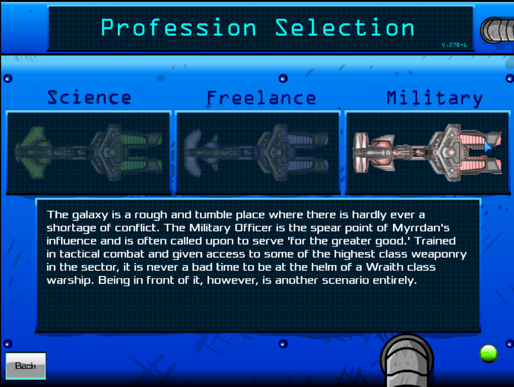

Military players have more strict missions and game play issues, and often receive negative responses from alien races, but the tradeoff is that military players get the most powerful ships. This is a great career for the player who enjoys space combat. Military players may only accept military missions, and may not recommend planets, and the ship is called a Warship. The military player has a very powerful ship, right from the start, with greater upgrade capabilities. However, this is balanced by a more rigid mode of game play.

The missions/quests for a military player are less exploratory in nature, and more focused on combat with hostile alien species. The military player has much less freedom of movement and also cannot simply upgrade his or her ship at will—the ship is upgraded when the player goes up in rank after successfully completing missions. So, you get more power, at the cost of freedom. The military player will spend a lot of time in combat.

Promotions will come from not just random killing of aliens, but from returning materials obtained from combat or from other sources. This allows a less aggressive player to still use the military career without feeling like a warmonger. Engaging in combat with peaceful aliens is strictly prohibited. The overall theme for a military player is: **“Great power, great responsibility.”**

.Military ship capabilities (total 25--special case):
[cols="3,2,2",options="header"]
|========================================================================
| System           | Start Level   | Maximum
| Engine           | 0             | 3
| Shielding        | 0             | 4
| Armor            | 0             | 1
| Laser Cannon     | 0             | 6
| Missile Launcher | 0             | 6
| Cargo pods       | 0             | 16
|========================================================================

.Military crew modifiers (total 500 points):
[cols="1,1"]
|========================================================================
| Science 	| 50%
| Navigation 	| 100%
| Tactical 	| 200%
| Engineering 	| 100%
| Medical 	| 50%
|========================================================================

== SHIP SYSTEMS / CREW

There are seven key systems to the ship:

These systems are accessed from the main menu. During the course of the game, some crew member may become injured or killed. When this happens, those systems are unavailable unless another crew member is put into that position. The captain usually fills in open positions in these cases. Here are the properties and skills that the player's captain and crew have:

=== Roles
. <<Captain>>
. <<Science Officer>>
. <<Navigator>>
. <<Tactical Officer>>
. <<Engineer>>
. <<Communications Officer>>
. <<Doctor>>

=== Properties

* Durability: 1-10
* Learn Rate: 1-10

=== Skills

* Science: 0 - 250
* Navigation: 0 - 250
* Engineering: 0 - 250
* Communication: 0 - 250
* Medicine: 0 - 250

A character generation screen will be used at the start of the game to allow the player to create a custom captain character which will represent the player's character throughout the game. While crew members may change, the captain will always remain at the forefront of the game. In addition to the usual traits above, the captain will also choose a profession, as discussed above in the section titled <<PROFESSIONS>>.

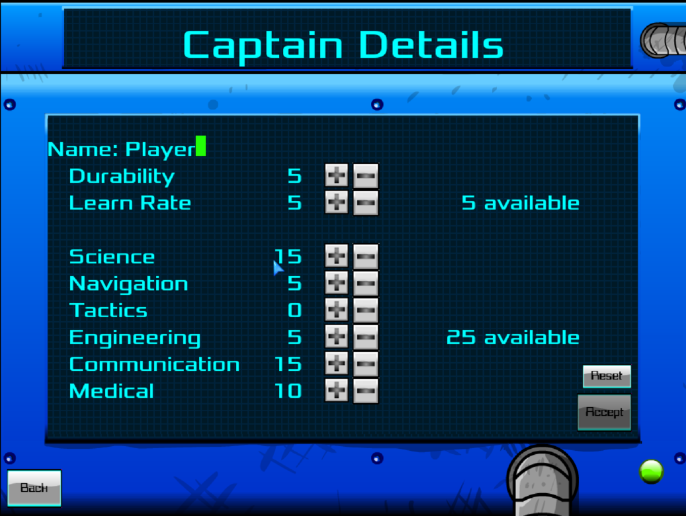

The crew member functions are accessible using the control panel.  In the original games, this was represented by a hierarchical menu system, where you would drill down to the crew member, issue a command, then have to drill back up to the bridge and drill down to another crew member to see their commands.  When learning the game, this requires a lot of down, up, down through the menu system.  Here is a suggested alternative representation of the control panel as proposed in the below image:

With this approach, each crew member has a tab and so you can immediately jump to any other crew member by simply clicking the appropriate tab.  From a selected tab you will be able to see all possible commands for that crew member, regardless of whether they're available in the current context.  Commands which are unavailable would be grayed out such that visually.  Individual command buttons will have icons and mouse-over tool tip text which would reveal the command name.

=== Captain

The captain provides backup skills for the whole crew, filling in positions that become vacant when an officer is injured or killed. The captain's skill affects the performance of the rest of the crew, as well. A poorly trained captain will reduce the capability of his officer's skill levels, while a highly trained captain will raise the efficiency of his crew.

==== Menu choices:

* Launch
* Descend
* Cargo Hold
* Quest Log

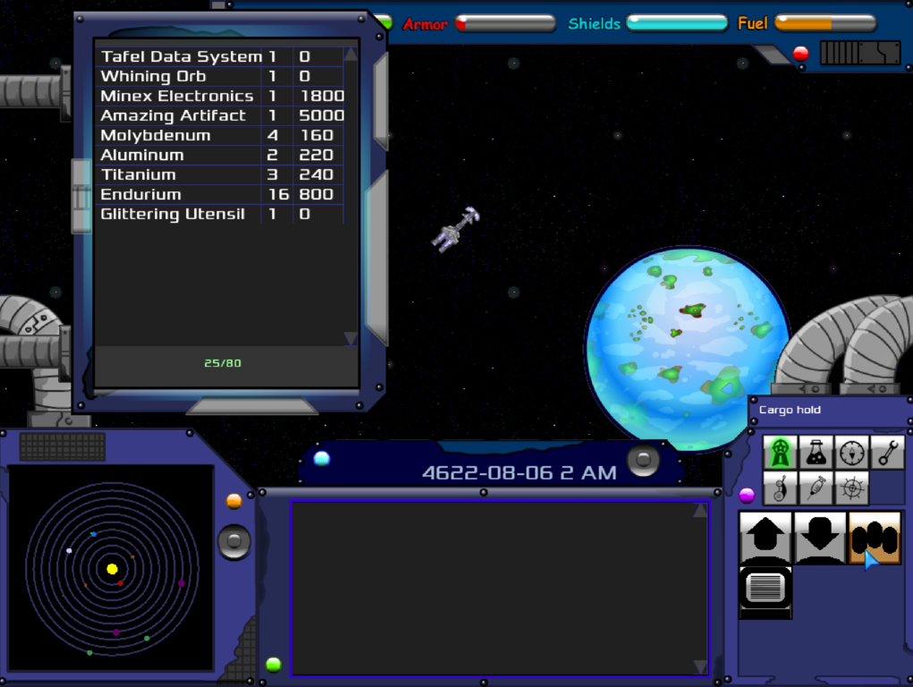

=== Science Officer

The Science Officer interprets data collected by the ship's sensors. A more competent science officer will provide more complete sensor readings. The information can be vital for determining the military capability of an alien vessel or the statistics of a planet.

==== Menu Choices

* Sensor Scan
* Sensor Analysis

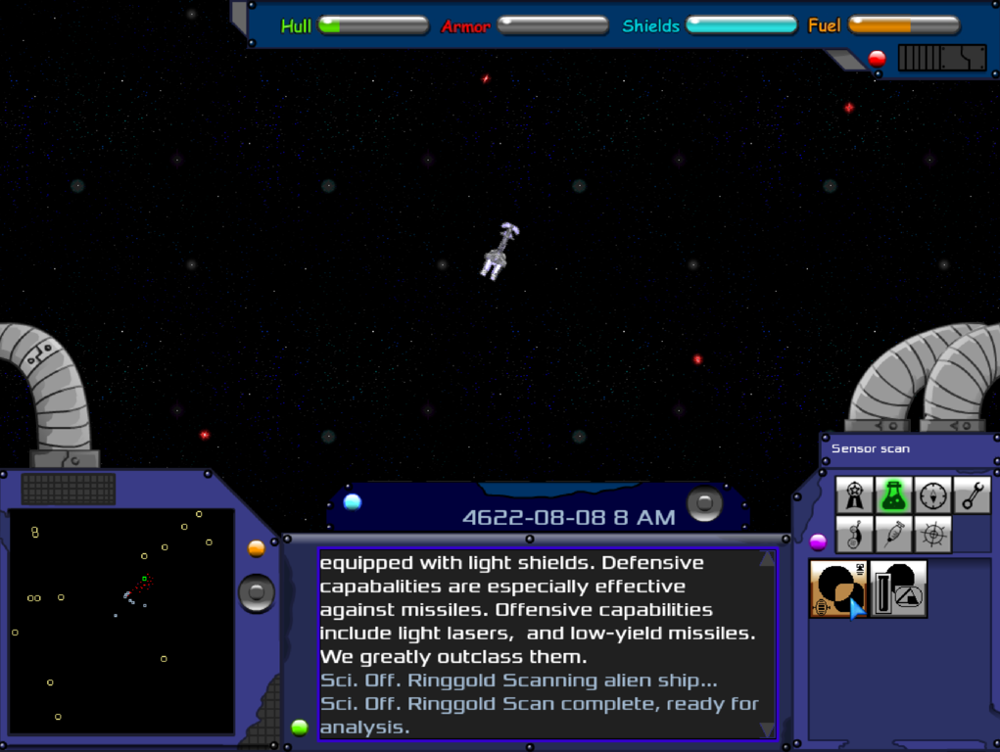

=== Navigator

Navigation is of primary importance to space and land travel. Without an effective Navigation Officer, you always risk getting lost. On planet surfaces, you chances of getting lost in storms is less with a competent Navigator at the controls. A Navigator can spot continuum fluxes in space that can instantaneously transport you across light years. . After going through a flux, the Navigator must determine the ship's new position.

==== Menu Choices

* Maneuver - used to travel in space from starport or leave orbit from a planet
* Orbit Planet - enters orbit around a nearby planet
* Dock with Starport - only functional at Myrrdan
* Hyperspace Engine - leaves the solar system and enters cyberspace only when the ship is not directly on top of a planet
* Starmap - calculates distance, fuel cost, etc

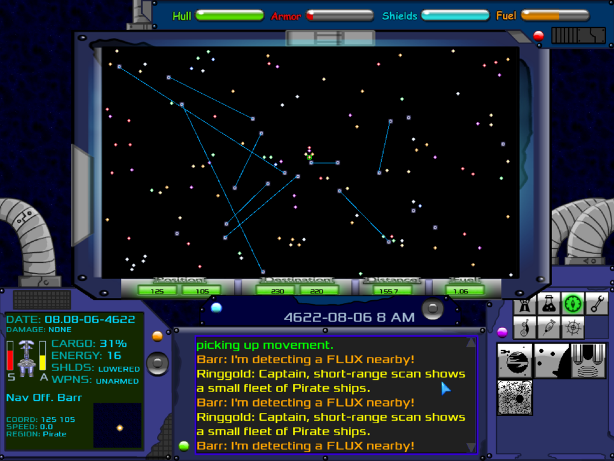

=== Tactical Officer

The Tactical Officer is responsible for the shields and weapons, which includes firing weapons at enemy ships and firing the laser on the terrain vehicle. More skill means greater accuracy in combat and capturing life forms.

==== Menu Choices

* Raise Shield / Drop Shield
* Arm / Disarm Weapons

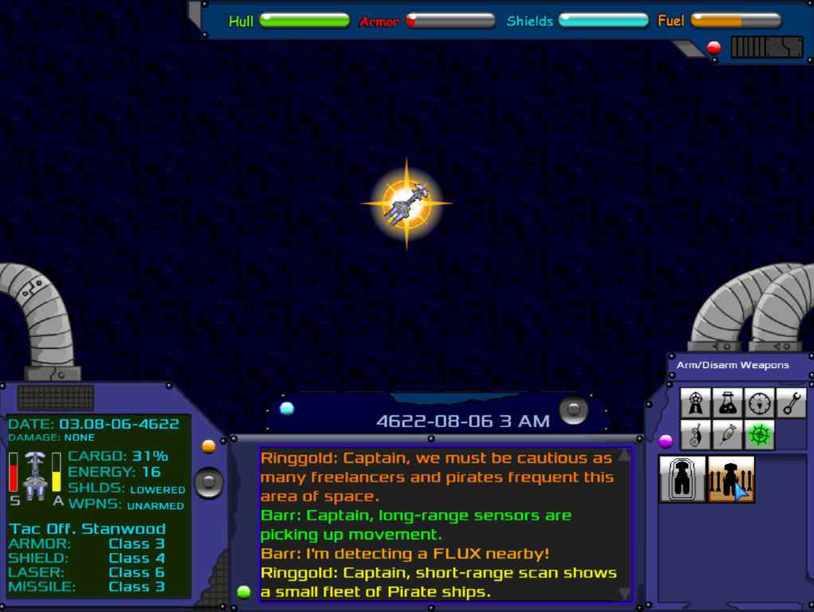

=== Engineer

The Engineering Officer repairs any damage your ship sustains and handles any future technology integrated into the ship. The speed with which repairs are made depends on the Engineer's skill level. If the Engineer is poorly skilled, repairs will require more repair minerals from the cargo hold, while greater skill requires fewer minerals. If you have none of the needed minerals, repairs cannot be made to the ship!

==== Menu Choices

* Damage Report - damage report on Aux Screen
* Repair Systems - repair a system not totally destroyed (excluding armor)
* Inject Fuel - converts one unit of endurium into ship fuel - shown on the top fuel gauge bar

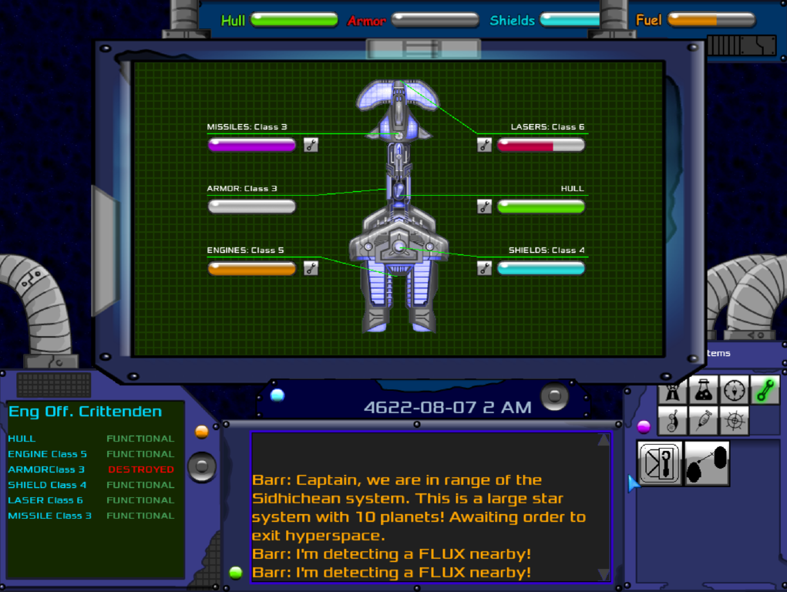

=== Communications Officer

Alien species are your primary source of information. The Communications Officer interprets all communications using an onboard translating device. A poorly skilled Communication Officer will not be able to translate alien communications.

==== Menu Choices

* Hail or Respond
* Question - Inquire: Themselves, Other Beings, The Past, Trade, General Info
* Statement - say something
* Posture - change posture (Friendly, Hostile, and Obsequious)
* Terminate - break connection
* Distress - distress call, may or may not succeed, very costly, towed back to starport

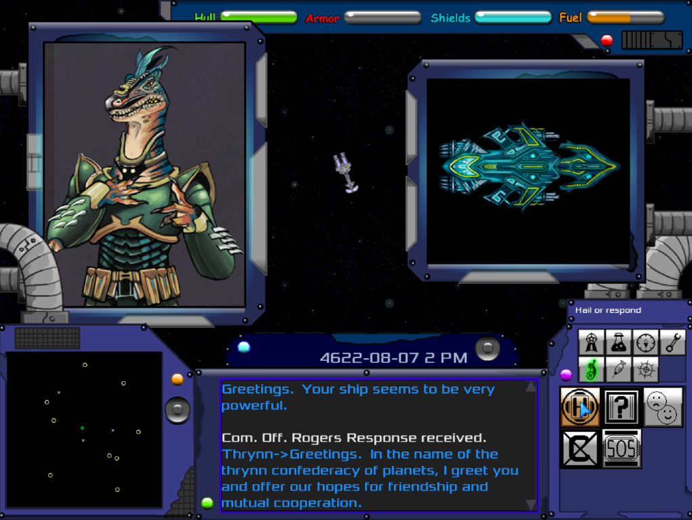

=== Doctor

The Medical Officer's skill level determines the speed and efficiency of medical treatment. The higher the skill level, the less time it will take to treat injured crew members.

==== Menu Choices

* Examine - examine a crew member
* Treat - only 1 at a time

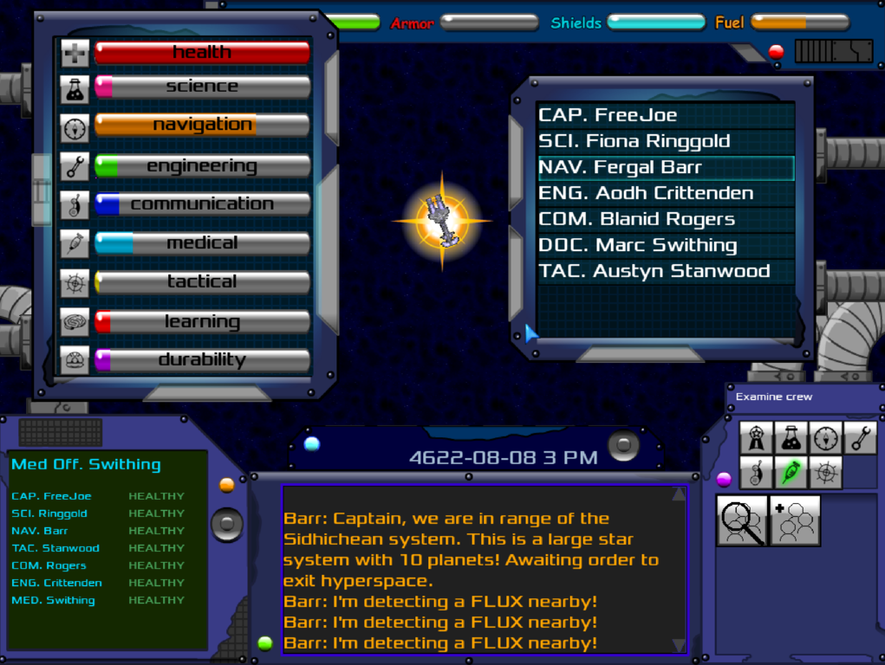

== STARPORT

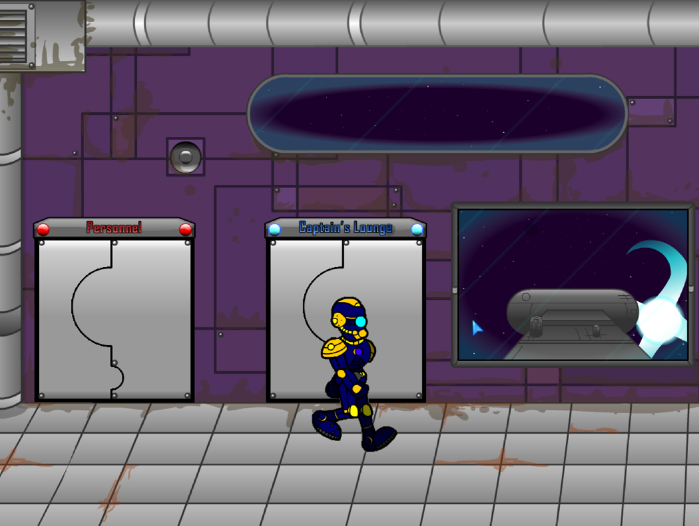

The Starport is the central hub for the player in the Myrrdan system. It has six modules:

* Personnel
* Captain’s Lounge
* Docking Bay
* Trade Depot
* Bank
* Research Laboratory / Cantina / War Room

=== Personnel

This is where you can outfit and train the ship's crew. A crew is hired from a pool of candidates.

* Assign crew to roles
* Hire / fire crew members
* View crew member statistics

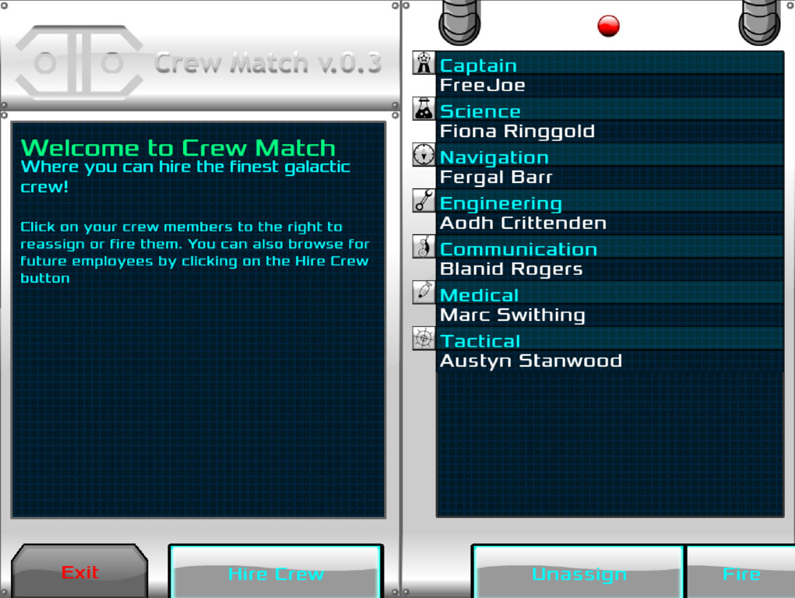

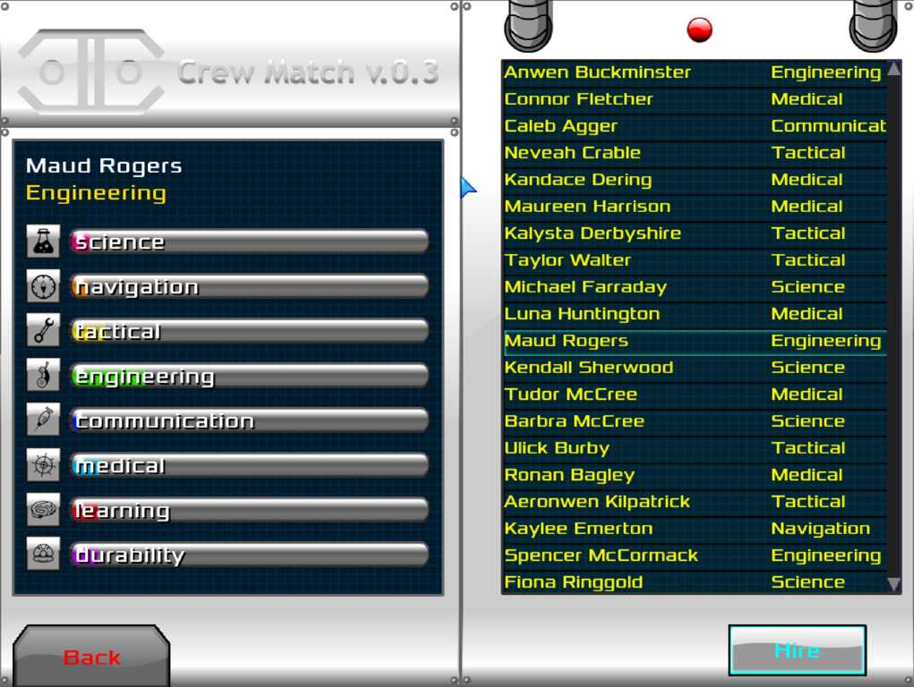

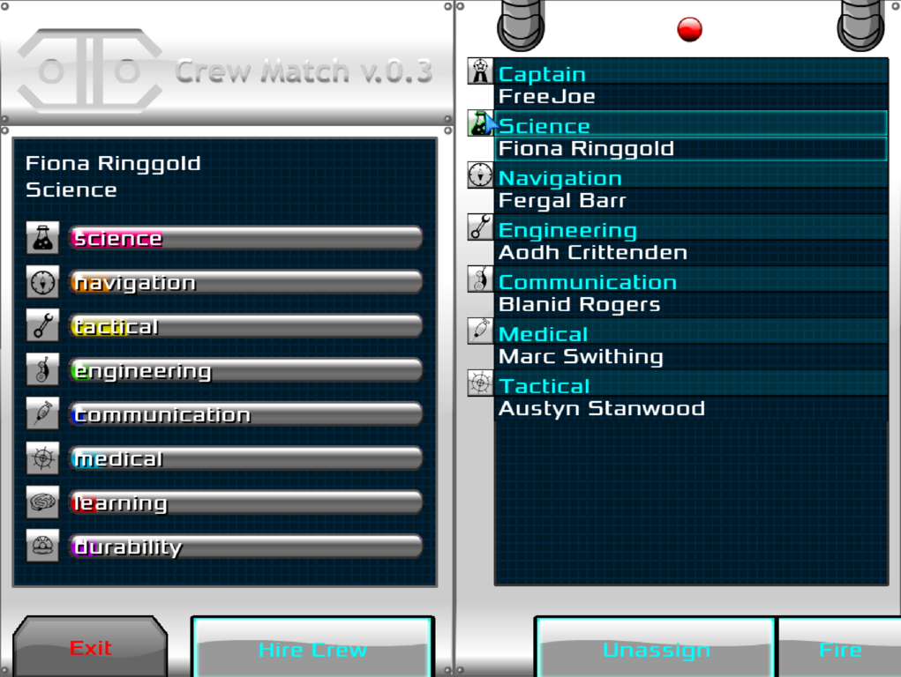

=== Captain’s Lounge

The Captain's Lounge is where the player can go to load and save the game, or start a new character.

==== Menu Choices:

* New
* Load
* Save

Note: The last position in the list at the bottom is the "quick save" slot.

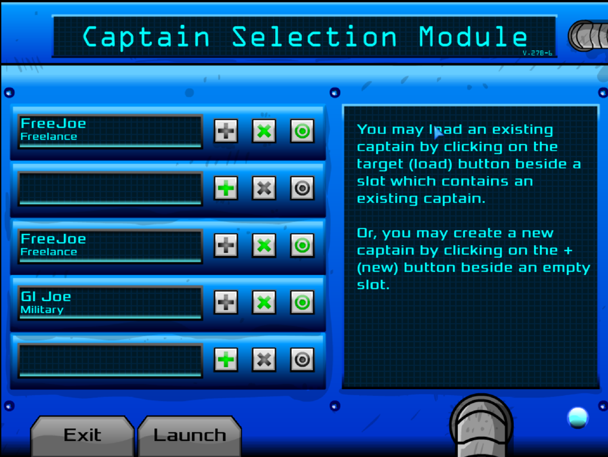

=== Docking Bay

This is where you can outfit your ship, repair damage, buy new ship components, and so on.

==== Menu Choices:

* Buy
** Cargo Pods
** Engines
** Shielding
** Armor
** Missile Launchers
** Laser Cannons
* Sell
* Repair
* Name
* Launch

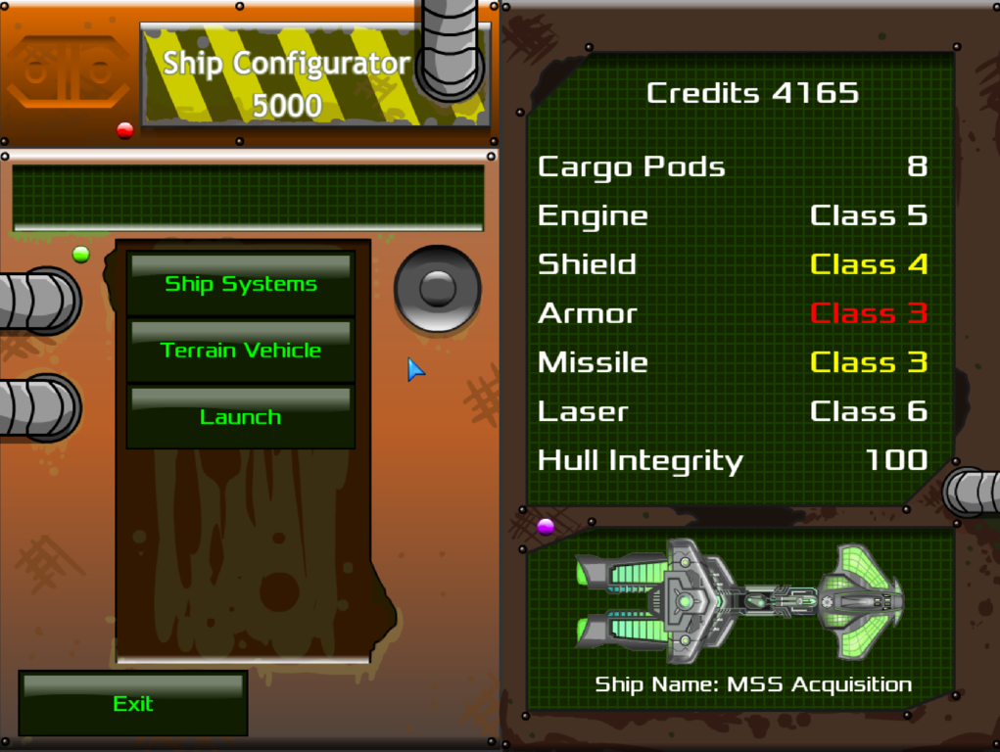

==== Prices

* Cargo Pods: 500

[cols="3,2,2,2,2,2,2",options="header"]
|========================================================================
|             | Class 1 | Class 2 | Class 3 | Class 4 | Class 5 | Class 6
| Engines     | 1,000   | 8,000   | 20,000  | 40,000  | 100,000 | 220,000
| Shielding   | 4,000   | 12,000  | 32,000  | 70,000  | 125,000 | 240,000
| Armor       | 1,500   | 3,100   | 6,200   | 12,500  | 25,000  | 70,000
| Missile Launchers
              |12,000   | 28,000  | 60,000  | 120,000 | 200,000 | 330,000
| Laser Cannons
              | 8,000   | 20,000  | 54,000  | 90,000  | 150,000 | 260,000
|========================================================================

=== Trade Depot

This is where you can go to buy and sell minerals, lifeforms, and artifacts in your ship's cargo hold.

==== Menu Choices:

* Buy
* Sell
* Exit

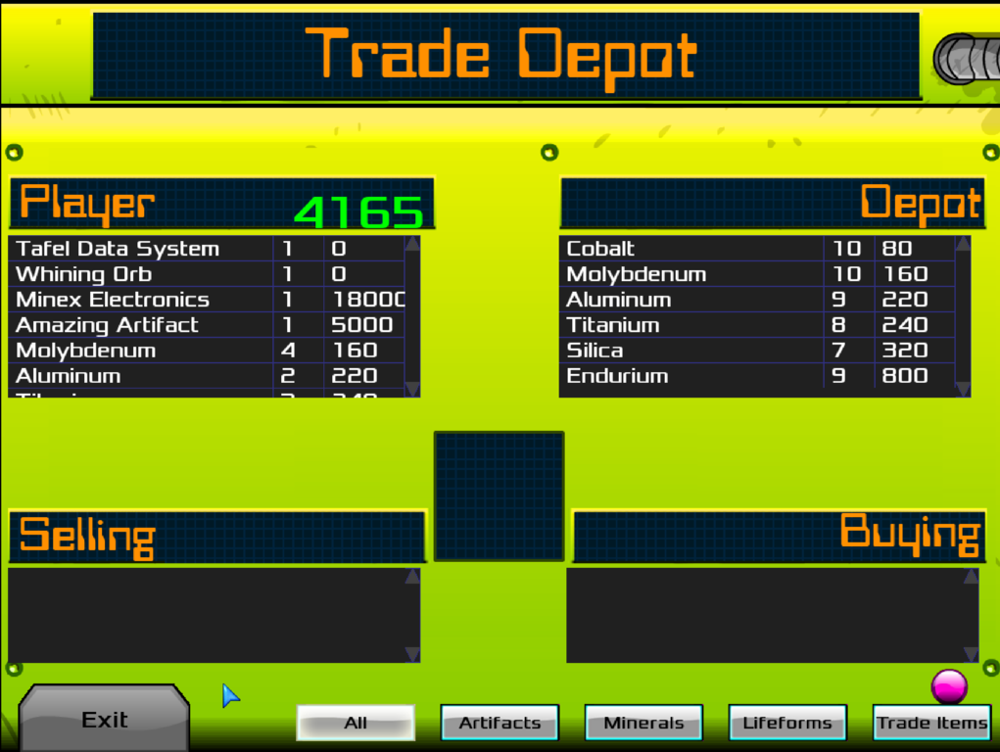

=== Bank

The Bank is where you can go to acquire a loan for urgent funding needs.  Loans must be repaid with interest.

==== Menu Choices:

* Pay
* Take
* Exit

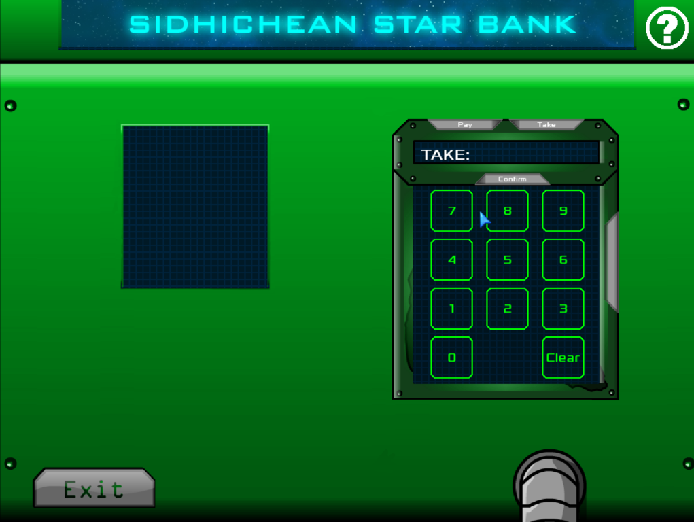

=== Research Lab / Cantina / War Room

This is the "Mission Room", where the player goes to receive and turn in missions. Each of the three professions provides a different version of this area of the Starport. Some of the quests/missions are linear, requiring a progression from one mission to the next in a chain, while others are optional and offered to give the player some bonuses.

Military Characters will see a "War Room".

Freelance Characters will see a "Cantina".

Science Characters will see a "Research Laboratory".

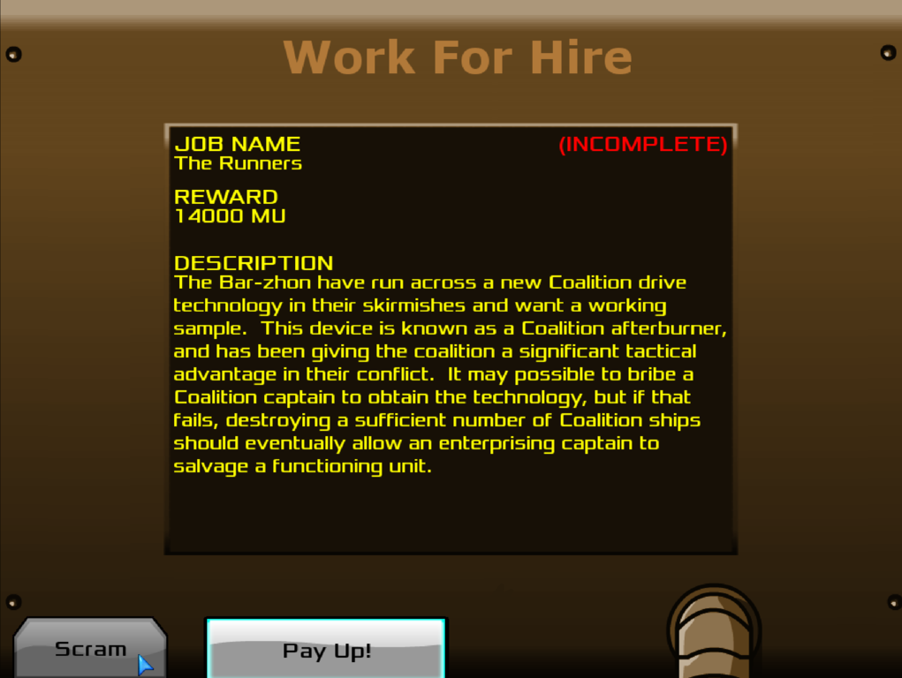

== INTER-STELLAR TRAVEL

Players will enter Hyperspace Travel mode by using the “Enter Hyperspace” command under the Navigation Menu Tab. Players must transverse Hyperspace in order to reach other stars and planetary systems in which to mine, trade, explore and discover the necessary plot elements to advance the story. Some quests will direct players to specific planets or planetary systems.

Navigation in Hyperspace will function in the same way as navigation in planetary space, except that in hyperspace fuel will constantly be consumed.

Players may also encounter NPC ships in Hyperspace that they will need to interact with.

Fluxes (i.e. __wormholes__) make inter-stellar travel more affordable and less time consuming. If a player needs to travel clear across the starmap to find some elusive artifact (via a clue), then it is beneficial to locate some fluxes along the way, and keep track of them. (Will we automatically chart fluxes for the player?  How about allowing the player to mark the starmap with a “pen”? It would be more like a navigation chart in that way. Remember, overall, this is an adventure game, and automating things takes away from the immersion.  Perhaps let the player type in text on the star chart and highlight planets and space coordinates).

This module makes it possible to navigate the ship between star systems, and is where most of the game play will take place (along with inter-planetary travel). This module will use the main viewer to scroll the starmap in an up-close zoom view, with visible star systems, nebulae, and any other inter-stellar objects.

== FUEL

Created a single fuel consumption function that unifies all fuel usage to 1.5% per "event". During hyperspace travel, the event is every game hour (2 real seconds). Entering/leaving hyperspace, landing, taking off, all require one call to this function, so it's very consistent. The 1.5% is divided by the engine class, so at class 6, it's .25%. In hyperspace, fuel is used continuously. In interplanetary, it's only consumed when engine thrust is on. Also, when fuel runs out, now Engineer "Inject" button in the control panel is used to refuel if Endurium is available.

.Sensors tracking alien ships in hyperspace
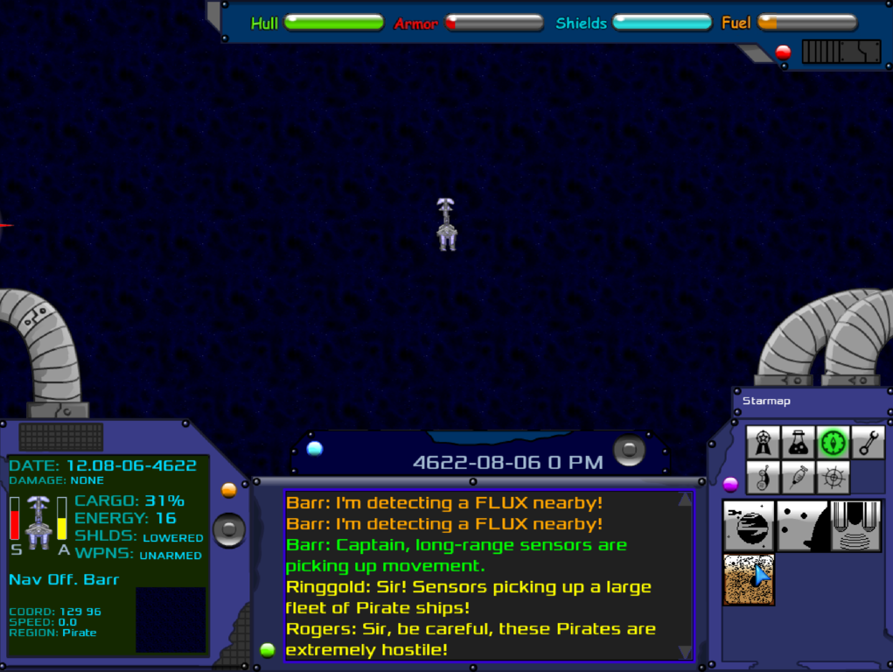

== THE STARMAP

The starmap is the center of the entire game, and there is an in-game version that the player uses for navigation. Since economics play a huge role in the game, it behooves a player to keep track of wormholes (called “fluxes” in Starlight), which save fuel. SF1 made the player keep track on his own, but SF2 showed discovered fluxes on the navigation screen.  This can take away from the game play, because it was more “interesting” to find fluxes, write them down, etc. We should consider if adding more automation in a game will make a player feel less drawn into it.
map

.The Starmap
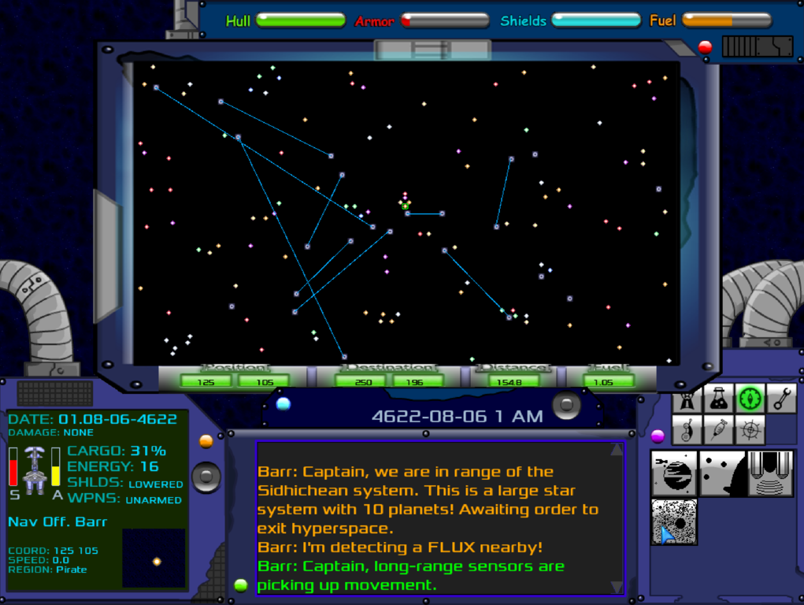

== ENCOUNTERS / SHIP COMBAT

Encounters occur in deep space and in a planetary system any time the ship is being navigated in either of these two modules. When an encounter takes place, the encounter module kicks in and dialog with aliens may begin. This module relies on the Encounter Editor data for communicating with alien ships. During an encounter, you may scan the alien ship. Dialog is real time, but will have the feel of a turn-based system. If you ignore an alien for too long, the communication will terminate. There are several postures that you can take with an alien: Obsequious, Friendly, and Hostile.

.Alien Communications
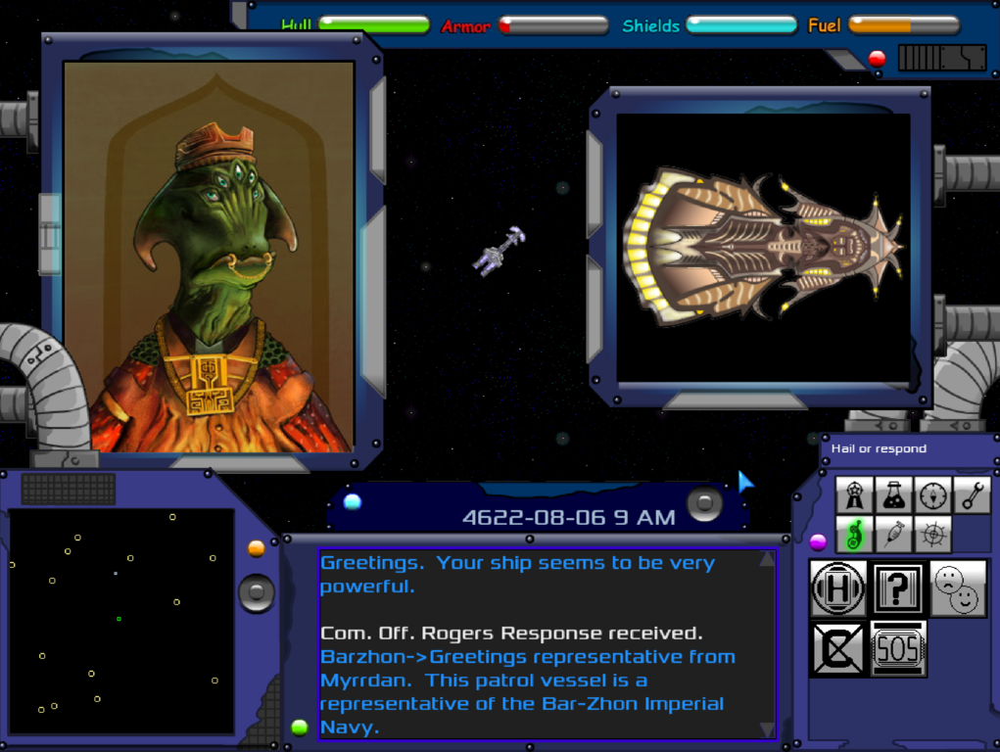

=== Alien Communications

While a chat may or may not take place, the combat engine is also engaged by the encounter. When an encounter first occurs, usually the ships are just moving around randomly and attempts to hail or receive a communication occur. You can also scan the alien ships at this point. Take a look at this screen. The player's ship is a miniscule sprite at the center, and alien ships are moving in relation to the player's ship in the center of the window, and appear as green. Obviously we'll use some nice-looking artwork here, but in the old games you had to use your imagination!

Ship combat often occurs during an encounter if the dialog goes sour and the aliens are offended (for whatever reason). Combat may also be triggered immediately upon an encounter of the aliens have no desire to chat. The combat mode automatically triggers the full-screen Main Viewer mode, and takes place in 2D using a fixed combat area with scaling of the ships based on distance. The entire battle takes place in one area, with no scrolling. When the player is far from enemy ships, the display will zoom out so that all ships are always visible. The player may scan alien ships in this mode as well. Generally, when an enemy ship's shields and armor have been damaged sufficiently, the ship will disengage from combat and either sends a distress call or attempt to flee. It is at this point when communication is also possible again. Aliens tend to be more accommodating when you are about to blow them out of space.

Tactical combat takes place in the main view screen when an alien vessel or fleet is encountered. The view in this window is scaled so that the entire battle and all ships are always in view. The Tactical Officer handles ship combat, including raising shields and arming weapons. If you leave these things armed / raised during normal travel, the ship will consume more fuel.

Combat depends a lot on your ship's capabilities. A very weak engine (like Class 1) will not maneuver very fast to dodge missiles or evade enemy ships. Weak or no shields or armor will result in damage to the ship and crew. The encounter module handles ship-to-ship combat and dialog with aliens (how's that for a point of view?).

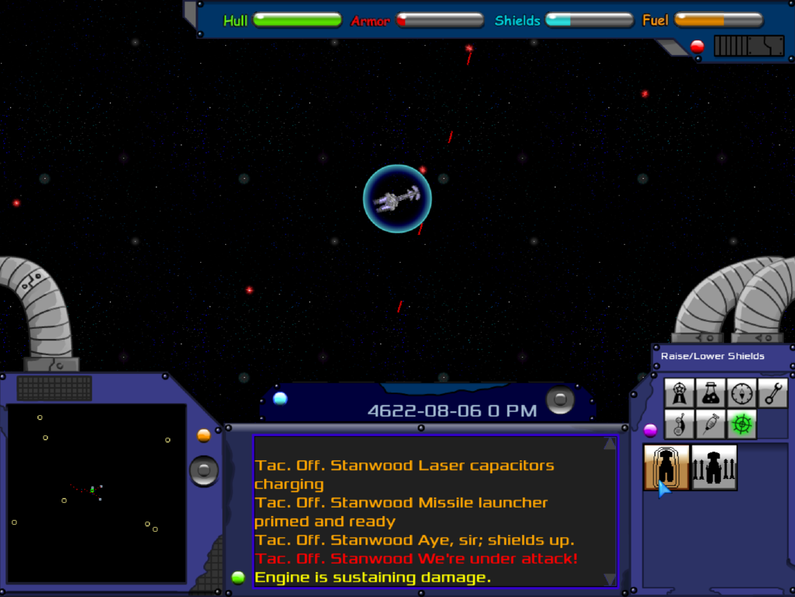

This will require some thought and discussion. It is real time. In the old games, the highest zoom level would render ships as little dots (green = player, gray = enemies, red = destroyed ships). Do we want to go to a full-screen mode for ship-to-ship combat? It certainly would make for a more interesting game, while the small main view screen limits the combat quite a bit. I vote for a large full screen tactical window with a border to show it is taking place in the main view screen.

After a battle is complete, you can switch to the Science officer and scan the debris of destroyed ships. You can then move over the debris and collect it using the Cargo choice in the Captain's menu. You must tell the Navigator to stop maneuvering in order to collect debris.

During the encounter, the "combat" screen is what you normally see. When you successfully engage in dialog with the alien, then the view switches to the dialog view showing a portrait of the alien character on the alien ship. Communication consists of the player choosing a posture and the alien responding depending on both the player's posture and a race-specific value known as that alien's attitude.

Over time, attitude slowly drifts back to the neutral value of 50.

If an alien ship is fired upon, the player loses 1 attitude point.

If an alien ship is destroyed, the player loses 5 attitude points.

If the attitude is already really low, then the alien will fire first and it's based on an attitude of 0-30. If alien is badly damaged, it will flee instead, otherwise it wanders.

== INTER-PLANETARY TRAVEL

When your ship collides with a star in the interstellar engine, the game switches to inter-planetary mode and you are presented with the planets orbiting a star. You can move the ship around within this star system and orbit planets in order to scan and/or land on them. Encounters with alien ships may still take place in this mode.
Interplanetary

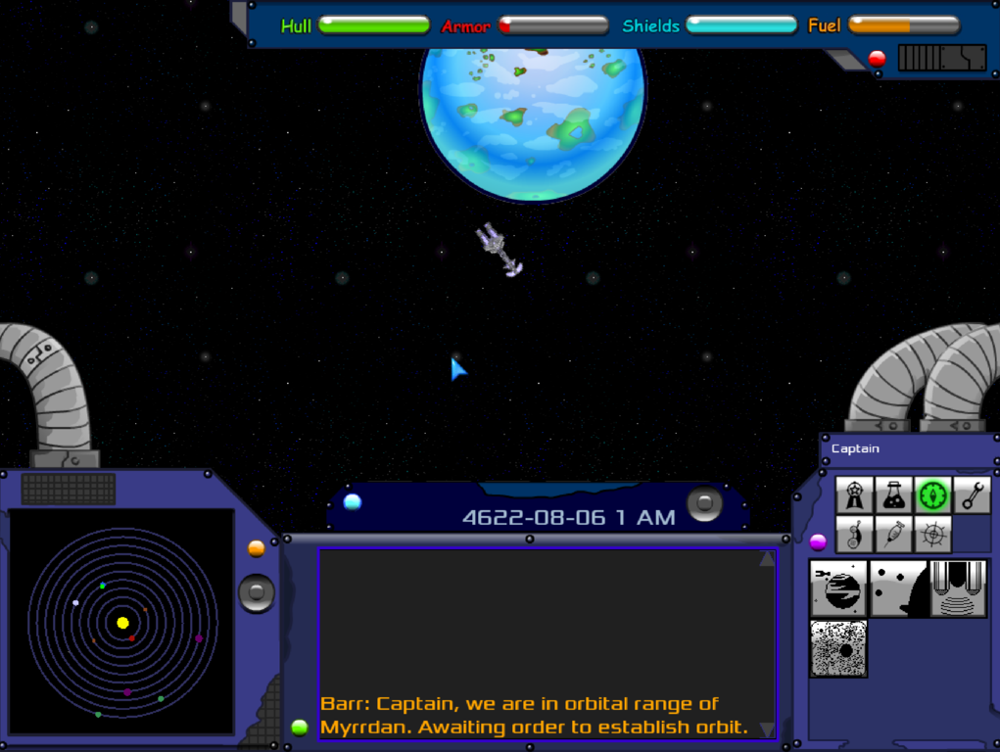

== PLANET ORBIT AND LANDING

You can orbit a planet in order to scan it for mineral content, life forms, and potentially land on the planet.

You can orbit a planet in order to scan it for mineral content, life forms, and potentially land on the planet. You must be careful not to attempt a landing if the gravity is too high! When you land on a planet the terrain vehicle is engaged and you are able to move around on the planet in order to gather minerals and life forms for later sale. The life forms can be stunned with a single shot of the TV's laser, or killed with two or more shots (although the life form cannot be captured if dead).

Once landed, you can depart in your terrain vehicle (TV) to explore the planet, capture life forms, and mine for minerals.

Pick Up (situational) – This command allows you to pull your TV onboard when it has run out of fuel, the command is only available while a TV is deployed and without fuel. The ship must be near the TV for this command to work.
orbit

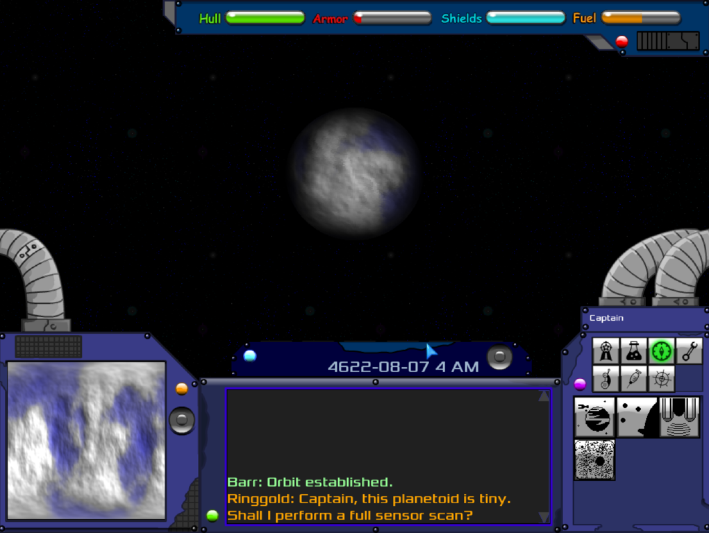

=== Exploring Planets: Ship Controls

Once you’ve descended to the planet’s surface you will be exploring the planet by ship initially. The map will display the planet’s surface as well as mineral and lifeform locations. You can use the regular movement controls but you must continue to watch your fuel meter.

While in your ship you will have two commands available in most situations, with one command only available while you’re TV is deployed and without fuel.

When you land on a planet the terrain vehicle is engaged and you are able to move around on the planet in order to gather minerals and life forms for later sale. The life forms can be stunned with a single shot of the TV's laser, or killed with two or more shots (although the life form cannot be captured if dead).
landing

image::exploring_planets.png[]

=== EXPLORING PLANETS

This module handles the terrain vehicle and robot mining vehicle and kicks in when you land on a planet. The landscape is rendered using a tile-based scrolling background. There will be random minerals and life forms on each planet, within the confines of the types of items found on the planet (via the Sector Editor program's planet editing capabilities).

The planets are constructed from these basic tiles which are used in the tile scroller and based on the planetary scan image. An artist will fill in the tiles with natural-looking terrain, and there may be intermediate tiles added to improve the realism of the surface. Planets are generated randomly in orbit the first time they are discovered, and a random number generator is seeded with the star # + planet #. This will cause the planet to look the same every time it is visited by the player, but will avoid the need to store the planet data after it has been generated.

Once landed, you can depart in your terrain vehicle (TV) to explore the planet, capture life forms, and mine for minerals.

The planet surface is implemented as a tile-based scroller with absolute X/Y pixel coordinates mapped to latitude/longitude coordinates. The "center" of the planet texture is the origin (0,0). Left from the origin is longitude west, while right from the origin is longitude east. Up from the origin is latitude north, while down from the origin is latitude south. The maximums are LAT 96N to 96S and LONG 96E to 96W.
coor

Once you have launched a TV, you will have control over the TVs movement with the normal movement controls. You must watch your fuel. If the TV runs out of fuel before you return to the ship you will be automatically placed back in control of the ship and will need to retrieve the TV by locating and picking it up.

While in the TV you will have access to a variety of commands based on what objects are selected.

=== T.V. Commands:

Dock::
    this command is always available, but will only function when near the ship. It docks the TV back on the ship and you resume control over the ship.
Scan::
    this command is also available at all times while using the TV. This will scan the selected lifeform or mineral to give you more details about it.
Stun::
    Stun is only available when a creature is targeted. Stun will fire a burst of energy forward from the front of the TV. If the energy burst hits a creature it will deplete some of the creature’s life. Enough bursts will stun the creature allowing you to capture it, too many will kill the creature. Stun is your only defense against hostile creatures while in the TV.
Capture::
    Once a creature is stunned, the Capture command becomes active. You can use this command to capture the creature in your cargo for sale or trade later. You must have enough room in your TV’s cargo and Ship’s Cargo or the creature will not be able to be taken with you.
Mine::
    This command is only available while a mineral deposit is targeted while in the TV. This command will mine some of the mineral from the deposit to place in your cargo. The mineral must have been scanned before you can mine it. You must have enough room in your cargo both on your ship and your TV in order to hold minerals that have been mined.

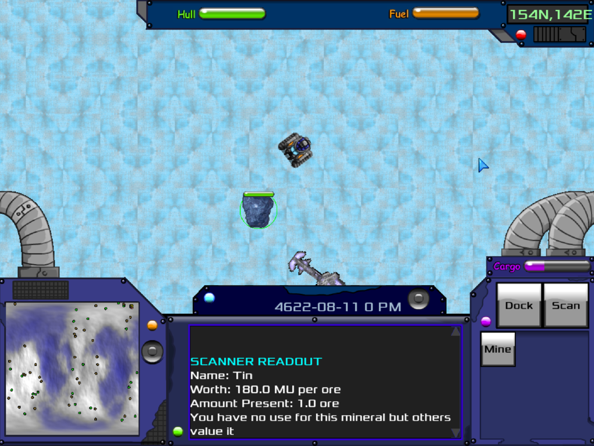

=== Asteroid Mining

One thing never found in SF1 or SF2 but what we now know would be a real aspect of a space-faring civilization is the mining of asteroids and cometary debris in the “oort” cloud surrounding a star system, and inside the system.  Asteroids are typically so huge that unless one has a robotic mining facility, it would take years to mine out. We will add the concept of asteroids to the game, which can be mined, but only if the player has the correct equipment! The asteroids will show up in the intra-system navigation window, along with the planets. This will in no way alter the game play.

It will simply add another means to make money. To that end, we will make the inter-planetary engine feel much larger than in the previous games, to make room for stellar objects like asteroids. Your ship will have to travel very far inside a system to reach planets and items on the system map (Aux Window). This will add to the reality that space is huge and planets can be billions of miles from their parent star (i.e. Pluto).

This should be very expensive and difficult to come by so the player can't get it too early in the game. Basically, player will be able to "orbit" an asteroid and then deploy a custom Robotic Mining Vehicle (RMV) onto the asteroid where there will be countless mineral deposits, essentially endless, every time the player lands. However, there must be a cost, or this will be a gold mine, literally, for the player. What is a good extraneous cost of asteroid mining? Perhaps it is time consuming? Perhaps only very cheap metals can be mined? The Mining Vehicle will have to be an upgrade.  This is similar to a Terrain Vehicle, but used for zero-g mining. The same planet tile engine will be used, but asteroid tiles should look dark gray and very difficult to navigate.

By only using plentiful but cheap minerals, it will be very time consuming for the player to accumulate wealth by mining asteroids, when a planet (on the other hand) does have heavier elements, but in limited supply. The quantity of each mineral found should be quite low, but there should be many of them on an asteroid. The player may launch and land again, and a new random distribution of minerals will be available on the asteroid. Here are potential minerals on an asteroid:

[cols="3,2,2",options="header"]
|========================================================================
| Mineral   | Value     | Probability
| Lead      | 40        | 70%
| Iron      | 60        | 10%
| Cobalt    | 80        | 10%
| Nickel    | 100       | 10%
|========================================================================

== GAME PLOT

Gameplay will fall into three different sequential types of events. At first, the player will be presented with a series of training quests or missions to acquaint them to the operation of the game. After these simple activities are completed, a series of 10 quests personalized to the player's profession are presented. Following this, a number of open ended quests are given to the player which require them to spend time communicating with the alien races and putting together clues to resolve a series of major conflicts. In his last stage, a total of 4 different major game states will occur, each different state loading different alien communication libraries.

After the class specific quests are finished, the game-state is changed from initial to virus, all of the available dialog will change, and the conventional missions become unavailable. After that point, completion of missions by retrieving and returning artifacts to Starport will trigger further plot advancement. Since the player is not explicitly told what is required to advance the plot at this point, clues to the location of needed items are given in the communication text.

The four plot stages are:

* Initial Stage
* Virus Stage
* War Stage
* Ancients Stage

=== The "Back Story"

For reference:  In SF1, the player started the game at a world called Arth, in an orbiting space station where the player spent most of his time early in the game. The player had to collect minerals and animals from nearby planets and asteroids in order to raise money. As such, the player was a mercenary, and his ship was not military. There was a civilization and a navy, but there was no large federation of any kind. Most of the planets in SF1 and SF2 had no large cities on them, due to limitations in the game’s scope.  Arth is not a new name for Earth, though the citizens of Arth trace their ancestry through myth from a home world called Earth. In SF1, you could actually find Earth, but it was not inhabited. (There was also a Star Trek Enterprise spoof that you could encounter, but could not communicate). The main plot and storyline of the first Starflight was that some force was causing stars to supernova, destroying all planets in the system. The player had to solve the problem before Arth gets destroyed! SF2 had a similarly grandiose story. In The Lost Colony, a new grandiose storyline follows but will not interact with the scenarios in SF2 since it takes place elsewhere in the galaxy.

The setting for The Lost Colony takes place in another part of the galaxy.  Originally on Earth, a fleet of Noah colony ships was launched into space, headed for several colony worlds. Noah 2 launched in 3454AD and landed on the planet Arth, the focus of SF1.  Noah 6 headed to the region of space in SF2. I propose using this story as a theme for the game.  Let's go with Noah 3. This colony ship launched from Earth (at 216/86 on the SF1 starmap) shortly after Noah 2, in 3456 AD, and headed upspin from Earth toward a star system. A distress call was received on Earth several decades later from Noah 3 which indicated it was attacked by an unrecognized alien ship and badly damaged. Noah 3 was transmitting its position in space when the signal suddenly went blank. Not the usual sort of static from overloading circuits when a ship is destroyed--it simply went blank. Earth assumed the ship ran into a wormhole of some sort due to how the signal ended so abruptly.

The Lost Colony takes place in parallel with SF1, when it was discovered that Endurium was actually an ancient alien race that existed in super-slow-motion. The Myrrdan civilization knows nothing about the true nature of Endurium. The plot of SF2 describes how the Spemin found a flux into the Beta sector and discovered an alternate fuel source--a mineral called Shyneum. That's the last you hear of the original Alpha sector. However, The Lost Colony was established a millennium ago (relative to the timeline in SF1/2), so we don't assume that the inhabitants of Myrrdan in the Gamma sector know anything about Endurium, other than the fact it is good for high-energy fuel.

== ALIEN RACES

Most of the storyline and plots come from interacting with alien races. The player’s interaction and stance has a lot to do with whether an alien will be cooperative or hostile toward the player. Some races respect strength, and so they will open fire if you communicate with them with your shields down, while they will talk if your shields are up. It’s just a matter of personality, which is a property of each race in the game. These properties are maintained throughout the game. If you seriously offend an alien, you might be able to make amends by helping them in some way, but if you outright destroy them, it’s very likely you’ll lose any clues they might have given you to advance the plot.

This will not leave the player at a dead end.  It may simply delay the story. For every location and artifact the player needs to collect, there should be many clues made available to the player…just not always quickly forthcoming. If you destroy a Veloxi who was going to give you the location of a powerful new ship weapon, you’ll lose out on that item if you approach the Veloxi in the wrong way (I.e. destroy them).

Bar-Zhon and Minex race spheres of influence and fleets are the largest and strongest in the sector and roughly occupy opposite ends of the star map. The player starts roughly in the center between these two major forces and scattered around also somewhat in the center area are the other races. Within and past Bar-Zhon territory lies the many ruins of the three extinct alien races. Also within Bar-Zhon territory but more densely packed around the ruins of the three extinct races Coalition ships may be found. Scattered randomly throughout the Gamma sector are randomly wandering Nyssian (very few) and Pirate ships. Tafel ships can also be found often found well outside their territory.

Tafel territory is a small section off by itself closer to the Bar-Zhon territory. Thrynn territory is a medium-sized sphere next to Minex territory, and Spemin a moderately large territory located roughly between both Minex and Thrynn territory and running off the edge of the map (blocked by the Minex and Thrynn fleets away from all the other races). On the opposite side of Thrynn territory moderately close to the player start location is a small Elowan territory.

Players will interact with alien races in Starflight: the Lost Colony in a variety of ways. Players will enter combat against alien enemies as well as holding discussions to gain new information. This section of the document will cover the various alien races and interaction the player will have with them.

Now we come to our official list of new civilizations for Starflight: The Lost Colony. Note the small number of races in this game. You have to consider that habitable worlds are extremely rare, so in a region of the galaxy as small as we are representing in the starmap of this game (under 500 stars), in reality there would be only a few planets capable of supporting life based on distance from the star, presence of water, and so on. The galaxy is not teeming with life. There are only a few alien races, but the player will interact with them extensively.

Pronunciations are provided to give an idea of how these races pronounce their own name, and to help reduce communication barriers.
1

=== Race 1: Elowan (eh-lo-an)

[.float-group]
--
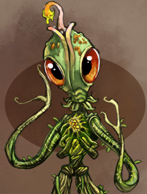
Biology::
    plant
--
History::
    Attacked and driven off two of their home worlds by the reptilian Thrynn in Alpha sector. The Elowan in Gamma know only scraps of their history pieced together through their genetic memory, as they were brought from Alpha eons ago as the slaves of the Thrynn colonists before rebelling. As rebels desperately fighting for their lives, these Elowan are considerably more hostile than their Alpha sector brethren.
Language Style::
    Poetic whisper sound so faint that it is often misunderstand to be telepathic, but words come from exhaled air flowing through the vestigial "mouth" on top of an Elowan's head.
Culture::
    The only purpose of their civilization is the ecological preservation of their homeworld, and the military defense of it.
[.float-group]
--
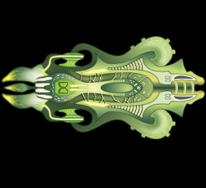
Ships::
    Ships are in a constant state of disrepair and varying technological levels. Engine class and shield class is never lower then the players. Although they are susceptible to Thrynn and Minex laser weapons, they are completely immune to Myrrdan lasers and the game progresses randomly will develop greater and greater resistance to missile weaponry as well. In the final plot stage, certain ships may be up to 5 times stronger than other Elowan ships.
--
Summary::
    Somewhat paranoid and ill trusting of humans. Racial memory and precise recall of events make them value truth and also makes manipulation or deceptive behavior difficult. Will purchase Thrynn Battle Machines from destroyed Thrynn vessels.
+
Elowan were an original SF1 race. TLC will not feature an Elowan home world, but rather an Elowan colony world with a large defensive fleet near their world. The Elowan race is a sentient carnivorous plant life form which resembles a highly evolved version of the Dionaea species of Earth.  They are in a protracted war with the Thrynn, as in the original game.
Initial::
Completely paranoid about humans, thinking them mercenaries simply hired by the Thrynn to pry intelligence out of them. Hesitant to answer any questions. Any quick inquiry about their home world or their ships is met with extreme hostility.
Virus::
From this stage forward, the Elowan consider Myrrdan provisional allies simply for not betraying them and will divulge much more information. Denies that the plague affects them.
War::
Militarily jointed in an alliance of convenience with the Thrynn against the Minex. Actually somewhat less threatened by the Minex attacks than they were with the Thrynn. Some knowledge of the Uyo/ancient conflict.
Ancients::
Despite the continued threat of infected ones and the virus, no longer constantly attacked and in the progress of building a civilization. Willing to share knowledge of the ancients for the first time. Observes that the Minex were pruning off the "mad ones" and preventing them from uniting. Insights to the telepathic control of the mad ones. Important hints about the city of the ancients.
+
"We had ascertained that a city of the ancients existed in our home sector, within a system inside the rim of starforming nebulae, almost exactly 100 parsecs outward from the war-torn Veloxi homeworld. Landing coordinates in empire terminology were 29N X 13W. How thou couldst make use of this knowledge is not known since that realm is nay inaccessible."
4

=== Race 2: Spemin (spee-min)

[.float-group]
--
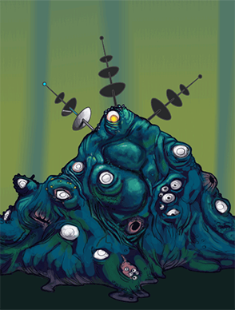
Biology::
    macro-amoeba, reproduce by budding
--
History::
    Unlike their brethren in Alpha and Beta sectors, these Spemin are the "original" race that migrated outward from Gamma. Their children in Alpha were corrupted (captured and enslaved by the Numlox and then abandoned) by other space faring Minexs, but the original Gamma Spemin developed their own spaceflight and a quite different culture. Non-offensive posture, but use moderately powerful ships.eager to trade and learn of other races.
Language Style::
    Fully translated into English.
Culture::
    Casual and cooperative, complete spineless cowards, yet eager to trade and learn of other races The Spemin of this sector as immature children as opposed to the "immature adolescent" Spemin of the Alpha sector.

[.float-group]
--
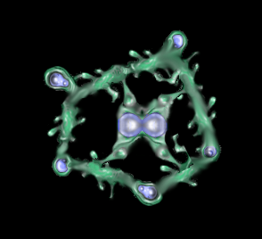
Ships::
    Initially incredibly weak, during the Minex war their weapons become significantly stronger. During the final stage their ships are still incredibly easy to destroy with lasers, but their ships become immune to missiles and they develop class 6 missile technology.
+
Spemin are also explorers, but their home world is placed between the Minex and the Thrynn, both of which to destroy them on sight. Despite this, they spend great efforts to travel and meet friendly aliens and are unperturbed by the hostile aliens on their borders, in the same way as a friendly farmer would be unconcerned with two dangerous cliffs bordering his territory.
--
initial::
    pitiful, childlike, whining, and overly verbose. Whenever a statement does does not sound convincing enough it is revised again, and again.
virus::
    somewhat more arrogant than the initial phase, small shifts in personality hint at telepathic monitoring of other races. Inadvertently reveal important bits of facts about the events occurring around them which no other race knows.
war::
    during this stage the Spemin are more than a little insane and schizophrenic. Their "regular" personality is terse and distracted. Wild statements are interjected into almost all comments. They also revealed that mental or telepathic transmissions have begun to emanate through space from the virus, which calls itself Tri'na'li'da.
ancients::
    completely controlled by the virus but not hostile to the player.

=== Race 3: Thrynn (there-in)

[.float-group]
--
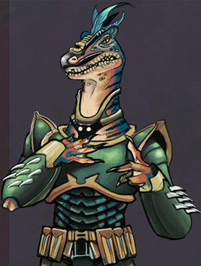
Biology::
    Reptilian
--
History::
    Back in Alpha, they were given space technology by humans, and then they discovered the Elowan in their home system and began systematically exploiting and attacking them. The Thrynn in Gamma sector know nothing of this history, but are still enemies of the Elowan. The Alpha Thrynn were somewhat benign due to technological underdevelopment and reliance upon Arth for technology. Gamma's Thrynn are much more powerful and self reliant as a result of long warfare.
Language Style::
    English translation results in an extra hiss on consonants.
Culture::
    Confederation of militias.  Focused on obtaining artifacts and empire building.  Very warlike and aggressive, engaged in generations-long war with the Elowan. Despite a claim to value ability and accomplishment, the only ability they value is military accomplishment. Very rigid society based on military rank and success in battle. Every Thrynn is required to spend many years in military service before specializing into other fields, such as science. Extreme arrogance has led to as weak infrastructure and as a result, innovation is slow, despite a desire to obtain technology. This is led to an open black market in alien artifacts and they will pay for certain artifacts to be brought to them. Will always attack instantly if hailed with a hostile attitude, but will have a small tolerance for hostile statements and questions after communications are established

[.float-group]
--
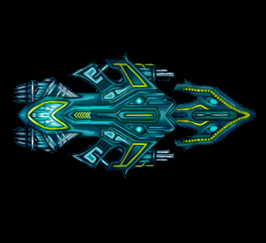
Ships::
    Military vessels are kept in top shape at all times and no variation in ship statistics is seen from one vessel to another. From the beginning of the game until the end, the Thrynn are rapidly retooling their fleet to resist ships other than the Elowan. Late in the game due to their advanced state of laser technology, their ships become highly resistant to laser weaponry. Laser weapon damage also improves over time and at all times Thrynn ships will have the same level of engines as the player.
--
Summary::
    Willing to communicate with humans, but manipulative and absolutist. Physiological differences make communication nearly impossible with Elowan, so there seems to be no end to their conflicts.
+
The Thrynn are an original SF1 race. The Thrynn is a reptilian race; militaristic, forceful, charismatic, and deceptive, but reasonable when interaction with others may prove beneficial. The Thrynn are very coldhearted figuratively and literally and very deterministic - everything has a cause and someone is credited or blamed for all actions.
Initial::
    Desirous of allying with humanity. Not alter statements are trustworthy, and statements concerning the Elowan are complete lies.
Virus::
    Race becomes isolationist as panic from the contagion spreads. Attacks the player on the grounds that Myrrdan is located in the center of pirate territory.
War::
    Apologetic over previous isolationist attitude. Again seeking the players help in a military alliance against the Minex. At this point an alliance of convenience has been made with the Elowan, however the Thrynn act somewhat sarcastic and gloating at their ability to convince the Elowan to act as "cannon fodder" for them.
Important hint::
    "Captured Elowan blather about every possible mindless subject from being interrogated, either to misdirect or focus their attention elsewhere than on the interrogation. Once a certain Elowan historian happen to say that all important ancient centers were placed at the planetary coordinates 29N X 13W. This may or may not be useful. "
Ancients::
    Warlike again declaring the player is Uyo - claiming that humanity is responsible for the virus, controlling the Minex, etc.

=== Race 4: Bar-Zhon (bar-oh-zin)

[.float-group]
--
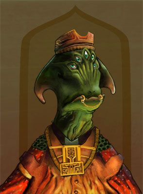
Biology::
    Unknown, very high metabolism, possible avian background
--
History::
    Extremely honorbound and ritual oriented society which places an emphasis on action and accomplishment.  Condescending in their behavior towards others, they may attack the player if the player gives offense.  A major active military power in the sector and knowledgeable and involved in most events.  Rebels from their own citizens and from nationalized defeated enemies founded the coalition, a group conducting low-grade corolla warfare against their empire.
Language Style::
    Formal and professional at all times. Does not respond or tolerate obsequious or hostile postures.
Culture::
    Ceremonial and honorable, Proud of their imperial position, their hard-fought victory in the great war, and disdainful of all of the races even as they have believe that they protect the "weaker" races. Caste system. very knowledgeable about recent history and all the other races.

[.float-group]
--
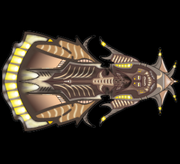
Ships::
    Heavily shielded, powerful missiles, and weak lasers initially. Like all other races benefit technologically from scavenging destroyed vessels from alien ships. Armor and missile technology increase slightly and their ships become twice as resistant to laser weaponry by the final stages.
--
Summary::
    About 10,000 years ago the Bar-Zhon race went to war with three other alien races and utterly wiped them out.  Although successful militarily, and damage from the war was long since rebuilt, culturally the Bar-Zhon race never recovered completely and collective fears have greatly limited the Bar-Zhon initiative and spirit and the race has somewhat stagnated since that time. They have the intelligence to solve problems, but fear and hesitancy will more often will prompt them to make the suggestion to the player on how to solve the problems facing the sector instead of acting themselves.
initial::
    reveals extensive knowledge of themselves, all of the other races, the great war, and hints at solutions to all of the current problems.
virus::
    basic information is mostly unchanged, provides hints for archaeological digs that lead the player to the conclusion of this stage.
+
"The technology of this infectious nano virus is far beyond the capabilities of any existing race in this area of space. The Bar-Zhon military has been mobilized in search of archaeological digs which may have uncovered this nightmarish technology." "Many Bx fleets were found to be patroling an area far outside their region of space, often near the base supports of the tower."
war::
    Discussion of Minex strategy, chosen to go into isolation until "the battle shifts" in their favor. Bravado and somewhat useful information given to cover up the fact that they are basically hiding out even though they consider themselves the preeminent military power.
about the location of the Transmodra home world::
    "Their home world was located at Dian Cecht 4 - 35,139. Investigate if you wish. We have already decoded some of their records and have learned that much of their weapon technology originated from an archaeological dig in the deserted city on Dagda III at planetary coordinates 83S X 51E. Feel free to follow up on these leads."
ancients::
    Distress over their crumbling society and continued strong attacks by infected ships. A hint to go to the Nyssians and Minex for more help.

"where we would have a good chance of finding Ancient ruins and Ancient technology"::
    "The Bar-zhon have vast endurium stores but these were collected hundreds of years ago from the former Sabion territories. The Sabion home world was Gorias 3 - 5,16. The Spemin and Minex occupy that region of space today. Search in that area or seek out the Nyssian if you wish to hear more idle speculation about the Ancients themselves."

=== Race 5: Nyssian (nish-en)

[.float-group]
--
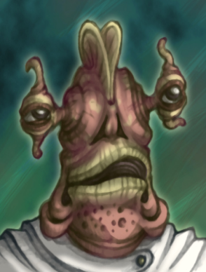
Biology::
    Shape shifting (not revealed initially).
--
History::
    An ancient race which wanders the stars in search of artistic beauty.  Arrogant and haughty, they collect knowledge as if it was a hobby, and their grand ideas are mostly rubbish but have occasional gems of wisdom.  As explorers they know a tremendous amount of history of the region but historical information is valuable and only disclosed to those who earn their friendship.
Language Style::
    Enigmatic generalizations and riddles.  Language becomes easier to understand once the player gains their trust.
Culture::
    nomadic and secretive. Focused on historical knowledge and rumors which are more often false. Because most of their knowledge comes from spying on other races, their extensive knowledge includes all the prejudices and falsehoods believed by the other races as well.

[.float-group]
--
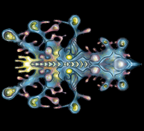
Ships::
    large organic ellipsoids containing only one individual.  Extremely powerful shields and engines, but relatively weak weapons.  Ships never travel in groups. In the latter stages, their shifts become more and more resistant to laser weaponry until they are completely immune. Laser damage of their laser weaponry slowly increases.
--
Summary::
    Individuals live in mostly automated spacecraft with a system of partial cryogenics which combined with their biology allows them to exist in a "quick recovery" hibernation state and skip over the boring parts of life. Because they can be quickly "dethawed" for encounters or problems barring violent death, most ship-board individuals live many thousands of years. Spies on all other races.
initial::
    Large number of generalities of other races. View of the old empire is told from the perspective of the Gazurtoid.
virus::
    Very little useful information, highly superstitious statements about everyone's doom from the unstoppable virus.
war::
    More superstitious statements about the end of everyone's existence. Includes a useful hint about how to communicate with the Minex.
+
"A single city was once discovered in the Dagda system, but its location has been lost with time. The remnants of the imperialists, The Coalition, may retain further information."
ancients::
    more information on what the Uyo and the Minex actually are. Attitude becomes more positive with the insight that the player has been able to stop the Minex war. Locations of the important constellations, clues to who to contact for other issues.

=== Race 6: Tafel (unpronounceable, nick-name)

[.float-group]
--
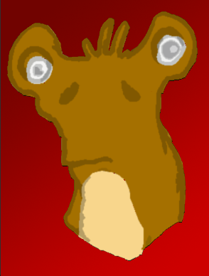
Biology::
    cybernetic rodent
--
History::
    Evolution on a primordial lava world, very few predators or competitors.  Highly cooperative and a non-aggressive.  Hardy and resourceful.  Recently achieved space travel through the disassembly and study of a crashed ship. Due to their cybernetic communication, essentially telepathic among themselves, the Tafel undergo revolutionary changes to their entire society regularly as new ideas and research is adopted. The race accepts every new idea wholly whether it is a good idea or not, and thus, never quite advances beyond their current state.
Language Style::
    Convoluted and tangential, occasionally intense and to the point.
Culture::
    Territorial Expansionist.  Eager to obtain new technology and knowledge.  Knowledge distributed and shared rapidly between members.

[.float-group]
--
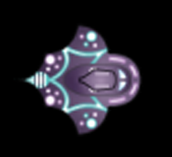
Ship style::
    Rocket with two side mounted cylindrical engines.  Very numerous and ships travel in large groups.  Primitive technology but fast ships which swarm enemies.  Damaged ships self repair rapidly.
--
Summary::
    enthusiastic explorers who ships can be found throughout the entire Gamma sector.  First to be hit by the super virus in a midpoint of the game
initial::
    This race has been cut and all dialogue and plot threads completely scrapped due to lack of artwork.
virus::
    This race has been cut and all dialogue and plot threads completely scrapped due to lack of artwork.
war::
    This race has been cut and all dialogue and plot threads completely scrapped due to lack of artwork.
ancients::
    This race has been cut and all dialogue and plot threads completely scrapped due to lack of artwork.

=== Race 7: Minex (my-neck)

[.float-group]
--
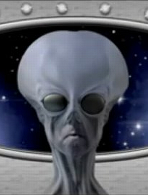
Biology::
    Electric eel.  Liquid atmosphere filled with sparks.
--
History::
    Xenophobic paranoid isolationists which collect and perfect military technology.  After the virus begins to affect them they start a military campaign to destroy all other species.  Can be convinced diplomatically with enough evidence to stop their campaign.  Moderately open after this point.
Language Style::
    Minimal and concise.
Culture::
    Complete isolationists.  Not hostile initially but will refuse to trade or converse. No attitude, posture, or ambiguous statement means a thing to them.

[.float-group]
--
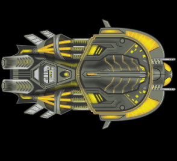
Ships::
    Minex ships are always as good as or better than the player ship. They are much more susceptible to laser damage then missile damage. Missiles may randomly do 1/20th to 2/5ths of their normal damage to any particular ship. Later in the game their ships become slightly more maneuverable and twice as resistant to laser damage. Later in the game their ships are in disrepair and may start off with between 10% to 100% of their health rather than always being in perfect repair.
--
Summary::
    Bio-engineered by the Ancients millennia ago.  Powerful telepathic minds unable to deal with others or even members of their own society at close range without either telepathically dominating or being dominated by them.  Frequently share ancient story of fighting a demonic enemy ages ago who was capable of cursing and destroying other races through mental powers.
initial::
    communications are terminated after a warning not to enter their territory. They immediately attack the player if the player does not flee.
virus & war::
    in both of these stages, a very tenuous line of dialogue is possible and results in the disclosure that something important is in the system Lir IV.
ancients::
    dialogue is possible, histories of Uyo and the ancient revealed. They describe their search for the Uyo while asking you to search for ancient ruins
1

=== Race 8: The Coalition

[.float-group]
--

Biology::
    Primarily Bar-Zhon; established after rebellion and were expelled from their home world. Now a collection of independent pirates of other races.
--
History::
    Formed centuries ago after the great war when the Bar-Zhon failed to completely incorporate all of the losing races as slave populations within the ropes. Suppressed dissident elements of Bar-zhon joined forces with discontented members of the slave races. This rebellion slowly grew, uniting also with many of the more organized criminals and rebel pirate organizations of other races.
Language Style::
    Sarcastic and simple English. Delights in taunting the player if the player uses an obsequious attitude. Attacks if the player starts with a hostile attitude. Become slightly more respectful in the last plot stage after the player resolves the Minex war.
Culture::
    Immediately hostile to all other players.  Will surrender or flee if defeated.  Detailed knowledge of current events and ship strengths of the other races.  Numerous but disorganized, interested in obtaining resources for further shipbuilding.

[.float-group]
--
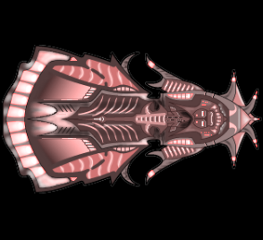
Ships::
    Very erratic ship statistics with great variation in laser and missile resistance, mass, and missile class from one ship to another. Engine, shield, and laser class somewhat mirrors the players, yet laser weaponry will never exceed two levels behind the player.
--
Summary::
    An erratic but somewhat honorable group with hostility focused primarily against the Bar-zhon. As the player gets stronger coalition fleets correspondingly get stronger.
initial::
    Somewhat useful background information about the other races. Does not dispute the Bar-zhon history of the great war.
virus::
    Decides to attack the player "for resources." Always hostile, cannot be reasoned with.
war::
    Apologizes for their attacks during the previous plot stage. Blames the Minex instead of the player for the virus. Reveals the home worlds of the three industrialists races. Giddy over the technology scavenged from ship ruins
ancients::
    Discovers the sonic disruptor artifact, the artifact which destroys endurium and nothing else.
Transmodra::
    industrialist and empire building. Responsible for starting the great war. Willing to go to any effort, use of biological weapons.
Bx::
    Heavy gravity race will where personal combat and personal dueling are held in the highest esteem. Little interest in technology, but warlike and joined in the attack on the Bar-zhon due to the perceived exploitation of their people.
Sabion::
    Useful artifacts from these three extinct races are scattered around the gamma sector.

== MINERALS & LIFEFORMS

[cols="1,3,1,3,1",options="header"]
|========================================================================
| ID    | MINERAL       | VALUE | DENSITY       | SYMBOL
| 30    | Lead          | 40    | 11.34 g·cm-3  | Pb
| 31    | Iron          | 60    | 7.86 g·cm-3   | Fe
| 32    | Cobalt footnote:ship[ship repair metals]       | 80    | 8.90 g·cm-3   | Co
| 33    | Nickel        | 100   | 8.908 g·cm-3  | Ni
| 34    | Copper        | 120   | 8.96 g·cm-3   | Cu
| 35    | Zinc          | 140   | 7.14 g·cm-3   | Zn
| 36    | Molybdenum footnote:ship[]   | 160   | 10.28 g·cm-3 	| Mo
| 37    | Tin           | 180   | 5.769 g·cm-3  | Sn
| 38    | Magnesium     | 200   | 1.738 g·cm-3  | Mg
| 39    | Aluminum footnote:ship[]     | 220   | 2.375 g·cm-3  | Al
| 40    | Titanium footnote:ship[]     | 240   | 4.506 g·cm-3  | Ti
| 41    | Potassium     | 260   | 0.89 g·cm-3   | K
| 42    | Antimony      | 280   | 6.697 g·cm-3  | Sb
| 43    | Sulfur        | 240   | 2.07 g·cm-3   | S
| 44    | Silica footnote:ship[]       | 320   | 2.6 g/cm3     | Si
| 45    | Bismuth       | 340   | 9.78 g·cm-3   | Bi
| 46    | Silver        | 360   | 10.49 g·cm-3  | Ag
| 47    | Gold          | 380   | 19.3 g·cm-3   | Au
| 48    | Platinum      | 400   | 21.45 g·cm-3  | Pt
| 49    | Thorium       | 420   | 11.7 g·cm-3   | Th
| 50    | Iridium       | 440   | 22.65 g·cm-3  | Ir
| 51    | Radium        | 460   | 5.5 g·cm-3    | Ra
| 52    | Uranium       | 480   | 19.1 g·cm-3   | U
| 53    | Quorsitanium  | 750   | 42.8 g·cm-3   | Qs
| 54    | Endurium footnote:fuel[fuel]    | 800   | unstable      | En
|========================================================================
